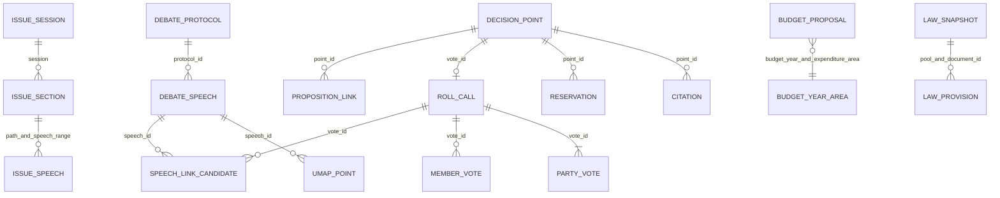

# Datakatalog: portfolio

Genererad från filerna i `frontend/public/data/` och utvalda källsnapshot under `data/` med `python platform/legacy/generate_data_dictionary.py`.
Kolumnerna nedan är **observerade fältnamn på tabellnivå** (och för den kuraterade voteringsvyn även underlistorna), inte en påstådd databasspecifikation.
JSON-filer med `schema_version`, `generated_at` och `data` listas som tabellen inuti `data`.
CSV-exporter som speglar JSON och riksmötespartitioner är inte nya observationer.

## Överblick

- `politics/parliament/`: upstreams publika export av tal, analyser, beslut, aktiviteter, budget och lagkandidater.
- `politics/decisions/` och `politics/laws/`: materialiserade läsvyer byggda ur ovanstående data respektive Allegorias lagtextpooler; dubletter av källobservationer.
- `debates/`: äldre ämneskörning samt aktiva korrigerade budgetramar. Ämnes-ID här får inte sammanfogas med nyare `politics/parliament/topics/`.
- `reports/`: RFC-mätning och två separata textkorpusars budgetordträffar.
- `jobs/`: fem aggregerade CSV-tabeller. Inga annonsrader finns i detta repo.
- `gold/`: materialiserat semantiskt lager; räknas inte som nya källobservationer. Se `docs/gold-semantic-model.md` för dess schema och mått.
- `platform/sources/allegoria/` utanför `public/` innehåller källsnapshotfiler och utkastannotationer; dessa är inte färdiga politiska riktningsmått. `data/budget/` innehåller lexikonets källa.

**Nyckelnotation:** `+` anger sammansatt nyckel, `→` en kontrollerad referens, och ordet *kandidat* betyder att kopplingen inte är ett fastslaget sakförhållande.

## Datatabeller, källsnapshot och metadata: observerade kolumner

### Debattprotokoll

- **Sökväg:** `frontend/public/data/politics/parliament/debates/index.json` (1 fil; 108 rader).
- **Kornighet:** Ett partiledardebattprotokoll. **Nyckel/referens:** `protocol_id`.
- **Kolumner (7):** `protocol_id`, `session`, `debate_date`, `debate_title`, `speech_count`, `reply_count`, `path`.

### Debattanföranden

- **Sökväg:** `frontend/public/data/politics/parliament/debates/*/*.json` (108 filer; 10 148 rader).
- **Kornighet:** Ett anförande i partiledardebatt. **Nyckel/referens:** `speech_id`.
- **Kolumner (17):** `speech_id`, `protocol_id`, `session`, `speech_date`, `speech_number`, `debate_title`, `speaker`, `original_speaker`, `party`, `original_party`, `original_person_id`, `is_reply`, `original_reply_code`, `speech_text`, `word_count`, `eligible`, `source_url`.

### Sakdebatt: riksmöten

- **Sökväg:** `frontend/public/data/politics/parliament/issues/index.json` (1 fil; 31 rader).
- **Kornighet:** Ett indexerat riksmöte. **Nyckel/referens:** `session`.
- **Kolumner (6):** `session`, `speech_count`, `reply_count`, `protocol_count`, `section_count`, `index_path`.

### Sakdebatt: avsnitt

- **Sökväg:** `frontend/public/data/politics/parliament/issues/*/index.json` (31 filer; 6 224 rader).
- **Kornighet:** Ett debattavsnitt i ett protokoll. **Nyckel/referens:** `section_id`.
- **Kolumner (8):** `section_id`, `debate_title`, `debate_kind`, `first_speech_number`, `last_speech_number`, `speech_count`, `reply_count`, `path`.

### Sakdebatt: anföranden

- **Sökväg:** `frontend/public/data/politics/parliament/issues/*/*.json` (1410 filer; 125 408 rader).
- **Kornighet:** Ett anförande i ett protokoll. **Nyckel/referens:** `speech_id`.
- **Kolumner (14):** `speech_id`, `protocol_id`, `session`, `speech_date`, `speech_number`, `debate_title`, `debate_kind`, `speaker`, `party`, `person_id`, `is_reply`, `original_reply_code`, `speech_text`, `source_url`.

### Talare

- **Sökväg:** `frontend/public/data/politics/parliament/speakers/summary.json` (1 fil; 113 rader).
- **Kornighet:** En talare och partibeteckning. **Nyckel/referens:** `speaker + party`.
- **Kolumner (6):** `speaker`, `party`, `speeches`, `words`, `first_speech_date`, `last_speech_date`.

### Ämnesöversikt · ny modell

- **Sökväg:** `frontend/public/data/politics/parliament/topics/summary.json` (1 fil; 26 rader).
- **Kornighet:** Ett modellämne. **Nyckel/referens:** `topic_id + modellversion`.
- **Kolumner (7):** `topic_id`, `topic_label`, `segments`, `speeches`, `words`, `word_share_pct`, `is_unclustered`.

### Ämne per riksmöte och parti

- **Sökväg:** `frontend/public/data/politics/parliament/sessions/*/topics.json` (33 filer; 3 784 rader).
- **Kornighet:** Parti × riksmöte × ämne. **Nyckel/referens:** `session + party + topic_id + modellversion`.
- **Kolumner (8):** `session`, `session_year`, `party`, `topic_id`, `topic_label`, `segments`, `words`, `word_share_pct`.

### Ämne per parti

- **Sökväg:** `frontend/public/data/politics/parliament/parties/*/topics.json` (9 filer; 3 784 rader).
- **Kornighet:** Parti × riksmöte × ämne. **Nyckel/referens:** `session + party + topic_id + modellversion`.
- **Kolumner (8):** `session`, `session_year`, `party`, `topic_id`, `topic_label`, `segments`, `words`, `word_share_pct`.

### UMAP-sampel · ny modell

- **Sökväg:** `frontend/public/data/politics/parliament/sessions/*/umap.json` (33 filer; 13 200 rader).
- **Kornighet:** Ett samplat textsegment. **Nyckel/referens:** `chunk_id + modellversion`.
- **Kolumner (14):** `chunk_id`, `speech_id`, `topic_id`, `topic_label`, `x`, `y`, `party`, `speaker`, `session`, `session_year`, `speech_date`, `excerpt`, `source_url`, `session_population`.

### Talarnärhet

- **Sökväg:** `frontend/public/data/politics/parliament/similarity/top.json` (1 fil; 500 rader).
- **Kornighet:** Ett sökresultat för två anföranden. **Nyckel/referens:** `speech_id + neighbor_id`.
- **Kolumner (13):** `speech_id`, `neighbor_id`, `cosine_similarity`, `speaker`, `party`, `speech_date`, `source_url`, `neighbor_speaker`, `neighbor_party`, `neighbor_date`, `neighbor_url`, `speech_excerpt`, `neighbor_excerpt`.

### Partiord

- **Sökväg:** `frontend/public/data/politics/parliament/parties/*/words.json` (9 filer; 892 rader).
- **Kornighet:** Parti × ord. **Nyckel/referens:** `party + word`.
- **Kolumner (8):** `party`, `word`, `occurrences`, `speeches_with_word`, `per_1000_words`, `frequency_ratio`, `common_rank`, `distinctive_rank`.

### Partiomnämnanden

- **Sökväg:** `frontend/public/data/politics/parliament/parties/*/mentions.json` (9 filer; 1 291 rader).
- **Kornighet:** Talare × omnämnd måltavla. **Nyckel/referens:** `speaker + speaker_party + target`.
- **Kolumner (7):** `speaker`, `speaker_party`, `target`, `target_type`, `mentions`, `speeches`, `per_1000_words`.

### Beslutspunkter

- **Sökväg:** `frontend/public/data/politics/parliament/sessions/*/decisions/*/points.json` (32 filer; 4 407 rader).
- **Kornighet:** En utskottsbeslutspunkt. **Nyckel/referens:** `point_id; vote_id om votering finns`.
- **Kolumner (18):** `point_id`, `session`, `document_id`, `designation`, `point`, `title`, `point_heading`, `proposal_text`, `decision_type`, `vote_id`, `winning_side`, `decision_date`, `source_url`, `motion_count`, `proposition_count`, `numbered_claim_count`, `reservation_count`, `vote_coverage`.

### Beslutsöversikt per utskott

- **Sökväg:** `frontend/public/data/politics/parliament/sessions/*/decisions/index.json` (2 filer; 32 rader).
- **Kornighet:** Utskott × riksmöte. **Nyckel/referens:** `session via sökväg + committee`.
- **Kolumner (4):** `committee`, `points`, `citations`, `reservations`.

### Dokumentcitat

- **Sökväg:** `frontend/public/data/politics/parliament/sessions/*/decisions/*/citations.json` (32 filer; 18 505 rader).
- **Kornighet:** En hänvisning i en beslutspunkt. **Nyckel/referens:** `point_id → beslutspunkt; document_id`.
- **Kolumner (16):** `point_id`, `session`, `designation`, `point`, `decision_date`, `vote_id`, `document_id`, `document_type`, `document_reference`, `claim_number`, `claim_scope`, `document_title`, `document_author`, `document_url`, `committee_url`, `link_evidence`.

### Reservationer

- **Sökväg:** `frontend/public/data/politics/parliament/sessions/*/decisions/*/reservations.json` (32 filer; 7 503 rader).
- **Kornighet:** En reservation/partikoppling till punkt. **Nyckel/referens:** `point_id → beslutspunkt`.
- **Kolumner (10):** `point_id`, `session`, `designation`, `point`, `reservation_number`, `party`, `proposal_type`, `heading`, `vote_id`, `source_url`.

### Debattspår på beslutspunkt

- **Sökväg:** `frontend/public/data/politics/parliament/sessions/*/decisions/debate-traces.json` (2 filer; 933 rader).
- **Kornighet:** Ett kandidatspår mellan punkt och tal. **Nyckel/referens:** `point_id + speech_id`.
- **Kolumner (26):** `point_id`, `session`, `designation`, `point`, `decision_date`, `point_heading`, `proposal_text`, `motion_count`, `proposition_count`, `numbered_claim_count`, `reservation_count`, `party_reservation_count`, `party`, `speech_id`, `speaker`, `speech_date`, `speech_excerpt`, `speech_url`, `cosine_similarity`, `party_position`, `speaker_vote`, `same_member`, `vote_id`, `decision_url`, `speech_link_evidence`, `interpretation_note`.

### Partiröster per votering

- **Sökväg:** `frontend/public/data/politics/parliament/sessions/*/votes.json` (2 filer; 11 488 rader).
- **Kornighet:** Votering × parti. **Nyckel/referens:** `vote_id + party`.
- **Kolumner (16):** `vote_id`, `session`, `designation`, `point`, `party`, `vote_date`, `title`, `point_heading`, `winning_side`, `cited_motion_count`, `yes_votes`, `no_votes`, `abstain_votes`, `absent_votes`, `party_position`, `source_url`.

### Voteringsöversikt

- **Sökväg:** `frontend/public/data/politics/parliament/votes/summary.json` (1 fil; 16 rader).
- **Kornighet:** Riksmöte × parti. **Nyckel/referens:** `session + party`.
- **Kolumner (10):** `session`, `party`, `decision_points`, `party_yes`, `party_no`, `party_abstain`, `member_yes`, `member_no`, `member_abstain`, `member_absent`.

### Motioner kopplade till votering

- **Sökväg:** `frontend/public/data/politics/parliament/sessions/*/decision-motions.json` (2 filer; 5 367 rader).
- **Kornighet:** Votering × motion. **Nyckel/referens:** `vote_id + motion_id`.
- **Kolumner (6):** `vote_id`, `motion_id`, `motion_reference`, `motion_title`, `motion_author`, `motion_url`.

### Debatt–votering, semantiska kandidater

- **Sökväg:** `frontend/public/data/politics/parliament/sessions/*/decision-speech-links.json` (2 filer; 933 rader).
- **Kornighet:** Ett tal–votering-kandidatpar. **Nyckel/referens:** `vote_id + speech_id (+ party)`.
- **Kolumner (19):** `vote_id`, `session`, `party`, `designation`, `point`, `vote_date`, `decision_title`, `point_heading`, `party_position`, `decision_url`, `speech_id`, `speaker`, `speech_date`, `speech_url`, `speech_excerpt`, `cosine_similarity`, `same_member`, `speaker_vote`, `relation_note`.

### Aktivitetsöversikt

- **Sökväg:** `frontend/public/data/politics/parliament/activities/summary.json` (1 fil; 16 rader).
- **Kornighet:** Riksmöte × parti. **Nyckel/referens:** `session + party`.
- **Kolumner (5):** `session`, `party`, `written_questions`, `interpellations`, `debate_speeches`.

### Skriftliga frågor

- **Sökväg:** `frontend/public/data/politics/parliament/sessions/*/activities/questions.json` (2 filer; 2 434 rader).
- **Kornighet:** Ett dokument. **Nyckel/referens:** `document_id`.
- **Kolumner (12):** `document_id`, `session`, `document_type`, `designation`, `document_date`, `title`, `subtitle`, `actor_party`, `government_department`, `status`, `source_url`, `explicitly_cited_decision_points`.

### Interpellationer

- **Sökväg:** `frontend/public/data/politics/parliament/sessions/*/activities/interpellations.json` (2 filer; 1 343 rader).
- **Kornighet:** Ett dokument. **Nyckel/referens:** `document_id`.
- **Kolumner (12):** `document_id`, `session`, `document_type`, `designation`, `document_date`, `title`, `subtitle`, `actor_party`, `government_department`, `status`, `source_url`, `explicitly_cited_decision_points`.

### Propositioner

- **Sökväg:** `frontend/public/data/politics/parliament/sessions/*/activities/propositions.json` (2 filer; 577 rader).
- **Kornighet:** Ett dokument. **Nyckel/referens:** `document_id`.
- **Kolumner (12):** `document_id`, `session`, `document_type`, `designation`, `document_date`, `title`, `subtitle`, `actor_party`, `government_department`, `status`, `source_url`, `explicitly_cited_decision_points`.

### Budgetförslag · ursprunglig upstream-export

- **Sökväg:** `frontend/public/data/politics/parliament/budgets/summary.json` (1 fil; 1 104 rader).
- **Kornighet:** Riksmöte × aktör × utgiftsområde. **Nyckel/referens:** `session + actor + expenditure_area`.
- **Kolumner (11):** `session`, `budget_year`, `expenditure_area`, `expenditure_area_name`, `actor`, `proposal_type`, `amount_msek`, `deviation_msek`, `budget_share_pct`, `document_id`, `source_url`.

### Budget/tal · ursprunglig upstream-export

- **Sökväg:** `frontend/public/data/politics/parliament/budgets/speech-alignment.json` (1 fil; 897 rader).
- **Kornighet:** Riksmöte × parti × utgiftsområde. **Nyckel/referens:** `session + party + expenditure_area`.
- **Kolumner (13):** `session`, `budget_year`, `party`, `expenditure_area`, `expenditure_area_name`, `amount_msek`, `deviation_msek`, `budget_share_pct`, `speech_keyword_occurrences`, `speech_attention_pct`, `attention_minus_budget_pp`, `alignment_correlation`, `source_url`.

### Budgetexekvering · upstream

- **Sökväg:** `frontend/public/data/politics/parliament/budgets/execution.json` (1 fil; 1 104 rader).
- **Kornighet:** Riksmöte × aktör × utgiftsområde. **Nyckel/referens:** `session + actor + expenditure_area`.
- **Kolumner (13):** `session`, `budget_year`, `expenditure_area`, `expenditure_area_name`, `actor`, `proposal_type`, `proposed_msek`, `approved_budget_msek`, `amendments_msek`, `outturn_msek`, `outturn_minus_proposal_msek`, `proposal_source_url`, `outturn_source_url`.

### Årsutfall

- **Sökväg:** `frontend/public/data/politics/parliament/budgets/outturn-areas.json` (1 fil; 783 rader).
- **Kornighet:** Budgetår × utgiftsområde. **Nyckel/referens:** `budget_year + expenditure_area`.
- **Kolumner (8):** `budget_year`, `expenditure_area`, `expenditure_area_name`, `appropriation_rows`, `approved_budget_msek`, `amendments_msek`, `outturn_msek`, `source_url`.

### Lagindex · parlamentsexport

- **Sökväg:** `frontend/public/data/politics/parliament/laws/index.json` (1 fil; 1 rad).
- **Kornighet:** En lagtextsnapshot. **Nyckel/referens:** `sfs_document_id + snapshot_version`.
- **Kolumner (5):** `sfs_document_id`, `document_title`, `snapshot_version`, `provisions`, `temporal_status`.

### Lagbestämmelser · parlamentsexport

- **Sökväg:** `frontend/public/data/politics/parliament/laws/*/provisions.json` (1 fil; 92 rader).
- **Kornighet:** En bestämmelse i lagtextsnapshot. **Nyckel/referens:** `sfs_document_id + provision_id + snapshot_version`.
- **Kolumner (19):** `provision_id`, `sfs_document_id`, `provision_suffix`, `kind`, `label`, `chapter`, `heading`, `provision_order`, `provision_text`, `text_sha256`, `document_title`, `snapshot_version`, `snapshot_retrieved_at`, `source_sha256`, `source_url`, `valid_from`, `valid_to`, `temporal_status`, `direction_eligible`.

### Nämnda lagar i debatt

- **Sökväg:** `frontend/public/data/politics/parliament/laws/mentions.json` (1 fil; 21 rader).
- **Kornighet:** En lexikal lagträff i ett tal. **Nyckel/referens:** `speech_id + sfs_document_id`.
- **Kolumner (14):** `speech_id`, `session`, `speech_date`, `speaker`, `party`, `speech_url`, `sfs_document_id`, `document_title`, `snapshot_version`, `temporal_status`, `matched_phrase`, `provision_id`, `link_evidence`, `direction_eligible`.

### Proposition–utskott, dokumentnivå

- **Sökväg:** `frontend/public/data/politics/parliament/legislative/proposition-committee-links.json` (1 fil; 393 rader).
- **Kornighet:** En proposition kopplad till punkt. **Nyckel/referens:** `point_id + proposition_id`.
- **Kolumner (11):** `point_id`, `session`, `designation`, `point`, `proposition_id`, `proposition_reference`, `proposition_title`, `proposition_url`, `committee_url`, `link_evidence`, `comparison_status`.

### Textjämförelse-exempel

- **Sökväg:** `frontend/public/data/politics/parliament/legislative/comparisons.json` (1 fil; 2 rader).
- **Kornighet:** Ett granskat textpar. **Nyckel/referens:** `pair_id`.
- **Kolumner (21):** `pair_id`, `source_document_id`, `source_document_type`, `source_reference`, `source_url`, `source_sha256`, `source_excerpt`, `source_excerpt_sha256`, `proposition_id`, `proposition_reference`, `proposition_url`, `proposition_sha256`, `proposal_section`, `provision_reference`, `proposal_excerpt`, `proposal_excerpt_sha256`, `link_status`, `comparison_status`, `review_note`, `direction_eligible`, `proposition_text_role`.

### Kuraterat voteringsindex

- **Sökväg:** `frontend/public/data/politics/decisions/*/index.json` (2 filer; 1 436 rader).
- **Kornighet:** En votering med åtta partirader inuti. **Nyckel/referens:** `id (= vote_id)`.
- **Kolumner (9):** `id`, `title`, `heading`, `designation`, `date`, `path`, `point`, `committee`, `parties`.

### Kuraterad voteringsdetalj

- **Sökväg:** `frontend/public/data/politics/decisions/*/*.json` (1436 filer; 1 436 rader).
- **Kornighet:** En votering med underlistor. **Nyckel/referens:** `vote_id i filnamn/sökväg`.
- **Kolumner (6):** `point`, `parties`, `members`, `citations`, `reservations`, `speech_links`.

  - `point`: `point_id`, `session`, `document_id`, `designation`, `point`, `title`, `point_heading`, `proposal_text`, `decision_type`, `vote_id`, `winning_side`, `decision_date`, `source_url`, `motion_count`, `proposition_count`, `numbered_claim_count`, `reservation_count`, `vote_coverage`.
  - `parties`: `vote_id`, `session`, `designation`, `point`, `party`, `vote_date`, `title`, `point_heading`, `winning_side`, `cited_motion_count`, `yes_votes`, `no_votes`, `abstain_votes`, `absent_votes`, `party_position`, `source_url`.
  - `members`: `member_name`, `member_id`, `party`, `vote`.
  - `citations`: `point_id`, `session`, `designation`, `point`, `decision_date`, `vote_id`, `document_id`, `document_type`, `document_reference`, `claim_number`, `claim_scope`, `document_title`, `document_author`, `document_url`, `committee_url`, `link_evidence`.
  - `reservations`: `point_id`, `session`, `designation`, `point`, `reservation_number`, `party`, `proposal_type`, `heading`, `vote_id`, `source_url`.
  - `speech_links`: `vote_id`, `session`, `party`, `designation`, `point`, `vote_date`, `decision_title`, `point_heading`, `party_position`, `decision_url`, `speech_id`, `speaker`, `speech_date`, `speech_url`, `speech_excerpt`, `cosine_similarity`, `same_member`, `speaker_vote`, `relation_note`.

### Lagindex · båda Allegoria-pooler

- **Sökväg:** `frontend/public/data/politics/laws/index.json` (1 fil; 516 rader).
- **Kornighet:** En dokumentversion i en pool. **Nyckel/referens:** `pool + id`.
- **Kolumner (6):** `id`, `pool`, `title`, `version`, `provisions`, `path`.

### Lagbestämmelser · v1

- **Sökväg:** `frontend/public/data/politics/laws/v1/*.json` (50 filer; 1 952 rader).
- **Kornighet:** En bestämmelse i v1-dokument. **Nyckel/referens:** `pool + document_id + provision_id`.
- **Kolumner (22):** `provision_id`, `document_id`, `provision_suffix`, `kind`, `source_anchor`, `source_anchor_occurrence`, `label`, `chapter`, `heading`, `order`, `text`, `subsection_anchors`, `amendment_notes`, `document_title`, `document_version`, `source_url`, `document_snapshot_id`, `title`, `version`, `source_page_url`, `source_sha256`, `retrieved_at`.

### Lagbestämmelser · v2

- **Sökväg:** `frontend/public/data/politics/laws/v2/*.json` (466 filer; 18 836 rader).
- **Kornighet:** En bestämmelse i v2-dokument. **Nyckel/referens:** `pool + document_id + provision_id`.
- **Kolumner (22):** `provision_id`, `document_id`, `provision_suffix`, `kind`, `source_anchor`, `source_anchor_occurrence`, `label`, `chapter`, `heading`, `order`, `text`, `subsection_anchors`, `amendment_notes`, `document_title`, `document_version`, `source_url`, `document_snapshot_id`, `title`, `version`, `source_page_url`, `source_sha256`, `retrieved_at`.

### Budgetförslag · aktivt korrigerad export

- **Sökväg:** `frontend/public/data/debates/budgets/summary.json` (1 fil; 1 104 rader).
- **Kornighet:** Riksmöte × aktör × utgiftsområde. **Nyckel/referens:** `session + actor + expenditure_area`.
- **Kolumner (12):** `session`, `budget_year`, `expenditure_area`, `expenditure_area_name`, `government_amount_msek`, `document_id`, `source_url`, `actor`, `proposal_type`, `deviation_msek`, `amount_msek`, `budget_share_pct`.

### Budget/tal · äldre exaktord-export

- **Sökväg:** `frontend/public/data/debates/budgets/speech-alignment.json` (1 fil; 897 rader).
- **Kornighet:** Riksmöte × parti × utgiftsområde. **Nyckel/referens:** `session + party + expenditure_area`.
- **Kolumner (17):** `session`, `budget_year`, `expenditure_area`, `expenditure_area_name`, `government_amount_msek`, `document_id`, `source_url`, `actor`, `proposal_type`, `deviation_msek`, `amount_msek`, `budget_share_pct`, `party`, `speech_keyword_occurrences`, `speech_attention_pct`, `attention_minus_budget_pp`, `alignment_correlation`.

### Partiordträffar · äldre export

- **Sökväg:** `frontend/public/data/debates/budgets/speech-keywords-all-parties.json` (1 fil; 2 592 rader).
- **Kornighet:** Riksmöte × parti × utgiftsområde. **Nyckel/referens:** `session + party + expenditure_area`.
- **Kolumner (5):** `session`, `party`, `expenditure_area`, `occurrences`, `keyword_share_pct`.

### Budgetårsurval

- **Sökväg:** `frontend/public/data/debates/budgets/year-selection-audit.json` (1 fil; 8 rader).
- **Kornighet:** En importerad FiU1-tabell. **Nyckel/referens:** `session`.
- **Kolumner (5):** `session`, `selected_year`, `upstream_selected_year`, `rows`, `source_url`.

### Budgettäckning

- **Sökväg:** `frontend/public/data/debates/budgets/coverage.json` (1 fil; 1 rad).
- **Kornighet:** Dokument/underlagsmetadata. **Nyckel/referens:** `session per underlista`.
- **Kolumner (5):** `generated_at`, `documents`, `rows`, `errors`, `note`.

### Språkmatchning: område

- **Sökväg:** `frontend/public/data/reports/budget-language.json` (1 fil; 10 368 rader).
- **Kornighet:** Korpus × metod × riksmöte × parti × område. **Nyckel/referens:** `corpus + method + session + party + expenditure_area`.
- **Kolumner (8):** `corpus`, `session`, `party`, `method`, `expenditure_area`, `occurrences`, `keyword_share_pct`, `forms`.

### Språkmatchning: täckning

- **Sökväg:** `frontend/public/data/reports/budget-language.json` (1 fil; 384 rader).
- **Kornighet:** Korpus × metod × riksmöte × parti. **Nyckel/referens:** `corpus + method + session + party`.
- **Kolumner (9):** `corpus`, `session`, `party`, `method`, `speeches`, `words`, `matched_speeches`, `hits`, `zero_areas`.

### Språkmatchning: lexikon

- **Sökväg:** `frontend/public/data/reports/budget-language.json` (1 fil; 71 rader).
- **Kornighet:** Område × uppslagsord. **Nyckel/referens:** `expenditure_area + keyword`.
- **Kolumner (2):** `expenditure_area`, `keyword`.

### RFC: dokumentprofiler

- **Sökväg:** `frontend/public/data/reports/rfc-drift.json` (1 fil; 2 rader).
- **Kornighet:** En RFC-version. **Nyckel/referens:** `rfc`.
- **Kolumner (6):** `rfc`, `sha256`, `url`, `requirements`, `counts`, `shares_pct`.

### RFC: motorexempel

- **Sökväg:** `frontend/public/data/reports/rfc-drift.json` (1 fil; 3 rader).
- **Kornighet:** Ett syntetiskt modalitetsbyte. **Nyckel/referens:** `before + after`.
- **Kolumner (3):** `before`, `after`, `direction`.

### Ämnesöversikt · äldre modell

- **Sökväg:** `frontend/public/data/debates/summary.json` (1 fil; 26 rader).
- **Kornighet:** Ett ämne i äldre modellkörning. **Nyckel/referens:** `topic_id + äldre modellversion`.
- **Kolumner (7):** `topic_id`, `topic_label`, `segments`, `speeches`, `words`, `word_share_pct`, `is_unclustered`.

### UMAP-sampel · äldre modell

- **Sökväg:** `frontend/public/data/debates/sessions/*/umap.json` (4 filer; 1 600 rader).
- **Kornighet:** Ett samplat textsegment. **Nyckel/referens:** `chunk_id + äldre modellversion`.
- **Kolumner (14):** `chunk_id`, `speech_id`, `topic_id`, `topic_label`, `x`, `y`, `party`, `speaker`, `session`, `session_year`, `speech_date`, `excerpt`, `source_url`, `session_population`.

### Ämne per riksmöte · äldre modell

- **Sökväg:** `frontend/public/data/debates/sessions/*/topics.json` (4 filer; 501 rader).
- **Kornighet:** Riksmöte × parti × ämne. **Nyckel/referens:** `session + party + topic_id + äldre modellversion`.
- **Kolumner (8):** `session`, `session_year`, `party`, `topic_id`, `topic_label`, `segments`, `words`, `word_share_pct`.

### Jobbannonser: översikt

- **Sökväg:** `frontend/public/data/jobs/01_overview.csv` (1 fil; 12 rader).
- **Kornighet:** Ett sammanfattningsmått. **Nyckel/referens:** `metric`.
- **Kolumner (2):** `metric`, `value`.

### Jobbannonser: år och roll

- **Sökväg:** `frontend/public/data/jobs/02_ads_by_year_role.csv` (1 fil; 16 rader).
- **Kornighet:** År × roll. **Nyckel/referens:** `year + role`.
- **Kolumner (4):** `year`, `role`, `ads`, `unique_employers`.

### Jobbannonser: månad och roll

- **Sökväg:** `frontend/public/data/jobs/03_ads_by_month.csv` (1 fil; 192 rader).
- **Kornighet:** Månad × roll. **Nyckel/referens:** `month + role`.
- **Kolumner (4):** `month`, `role`, `new_ads`, `unique_employers`.

### Jobbannonser: junior per månad

- **Sökväg:** `frontend/public/data/jobs/05_junior_by_month.csv` (1 fil; 187 rader).
- **Kornighet:** Månad × roll (enbart förekommande rader). **Nyckel/referens:** `month + role`.
- **Kolumner (5):** `month`, `role`, `junior_ads`, `total_ads`, `junior_share_pct`.

### Jobbannonser: teknik

- **Sökväg:** `frontend/public/data/jobs/06_top_technologies.csv` (1 fil; 64 rader).
- **Kornighet:** Kohort × teknik. **Nyckel/referens:** `cohort + technology`.
- **Kolumner (4):** `cohort`, `technology`, `ads_mentioning`, `share_pct`.

### Metadatadokument: politik-katalog

- **Sökväg:** `frontend/public/data/politics/catalog.json` (1 fil; 1 rad).
- **Kornighet:** Ett fil- och källregister. **Nyckel/referens:** `ingen observationsnyckel`.
- **Kolumner (4):** `schema_version`, `sources`, `local_corpus_note`, `files`.

### Metadatadokument: politik-översikt

- **Sökväg:** `frontend/public/data/politics/overview.json` (1 fil; 1 rad).
- **Kornighet:** En övergripande status. **Nyckel/referens:** `ingen observationsnyckel`.
- **Kolumner (5):** `parliament`, `sessions`, `law_pools`, `meaning_tests`, `validated_vote_direction_pairs`.

### Metadatadokument: parlament-översikt

- **Sökväg:** `frontend/public/data/politics/parliament/overview.json` (1 fil; 1 rad).
- **Kornighet:** En genererad översikt. **Nyckel/referens:** `ingen observationsnyckel`.
- **Kolumner (3):** `schema_version`, `generated_at`, `data`.

  - `data`: `imported_speeches`, `imported_replies`, `debate_protocols`, `issue_speeches`, `issue_protocols`, `issue_replies`, `analyzed_speeches`, `analyzed_segments`, `sessions`, `first_date`, `last_date`, `topic_method`, `cluster_silhouette_cosine_sample`, `cluster_unclustered_share`, `umap_note`, `budget_frame_rows`, `vote_sessions`, `committee_points`, `policy_documents`, `outturn_last_year`, `sfs_provisions`, `legislative_comparison_examples`, `proposition_committee_links`.

### Metadatadokument: parlament-manifest

- **Sökväg:** `frontend/public/data/politics/parliament/manifest.json` (1 fil; 1 rad).
- **Kornighet:** Ett filregister. **Nyckel/referens:** `ingen observationsnyckel`.
- **Kolumner (3):** `schema_version`, `generated_at`, `data`.

  - `data`: `dataset`, `description`, `files`.

### Metadatadokument: Meaning Quality

- **Sökväg:** `frontend/public/data/politics/meaning.json` (1 fil; 1 rad).
- **Kornighet:** En motorstatus och utkast. **Nyckel/referens:** `ingen observationsnyckel`.
- **Kolumner (5):** `passed`, `total`, `cases`, `examples`, `validated_vote_direction_pairs`.

### Metadatadokument: rapportmanifest

- **Sökväg:** `frontend/public/data/reports/manifest.json` (1 fil; 1 rad).
- **Kornighet:** Ett exportmanifest. **Nyckel/referens:** `ingen observationsnyckel`.
- **Kolumner (4):** `generator`, `dependency`, `inputs`, `outputs`.

### Metadatadokument: äldre debattöversikt

- **Sökväg:** `frontend/public/data/debates/overview.json` (1 fil; 1 rad).
- **Kornighet:** En genererad översikt. **Nyckel/referens:** `ingen observationsnyckel`.
- **Kolumner (3):** `schema_version`, `generated_at`, `data`.

  - `data`: `imported_speeches`, `analyzed_speeches`, `analyzed_segments`, `sessions`, `first_date`, `last_date`, `topic_method`, `umap_note`, `budget_frame_rows`.

### Budgetlexikon · källa

- **Sökväg:** `data/budget/keywords.csv` (1 fil; 71 rader).
- **Kornighet:** Utgiftsområde × sökord. **Nyckel/referens:** `expenditure_area + keyword`.
- **Kolumner (2):** `expenditure_area`, `keyword`.

### Allegoria: v1 bronze

- **Sökväg:** `platform/sources/allegoria/sources-v1/bronze/sfs/*.json` (50 filer; 50 rader).
- **Kornighet:** Ett källsnapshot av lagtext. **Nyckel/referens:** `document_snapshot_id`.
- **Kolumner (19):** `document_snapshot_id`, `document_id`, `designation`, `title`, `version`, `department`, `source_type`, `source_subtype`, `issued_at`, `published_at`, `retrieved_at`, `source_page_url`, `source_data_url`, `source_raw_file`, `source_sha256`, `payload_size_bytes`, `text`, `html`, `raw_xml`.

### Allegoria: v2 bronze

- **Sökväg:** `platform/sources/allegoria/sources-v2/bronze/*.json` (496 filer; 496 rader).
- **Kornighet:** Ett källsnapshot av lagtext. **Nyckel/referens:** `document_snapshot_id`.
- **Kolumner (19):** `document_snapshot_id`, `document_id`, `designation`, `title`, `version`, `department`, `source_type`, `source_subtype`, `issued_at`, `published_at`, `retrieved_at`, `source_page_url`, `source_data_url`, `source_raw_file`, `source_sha256`, `payload_size_bytes`, `text`, `html`, `raw_xml`.

### Allegoria: v2 urvalsmanifest

- **Sökväg:** `platform/sources/allegoria/sources-v2/document_ids.json` (1 fil; 1 rad).
- **Kornighet:** Ett urvalsmanifest. **Nyckel/referens:** `ingen observationsnyckel`.
- **Kolumner (4):** `pinned_at`, `target_count`, `selection_rule`, `document_ids`.

## Kontrollerade relationer

**Validerat i de här exporterna:** 4 407 unika `point_id`; 1 436 av dem har ett `vote_id`.
Varje importerad votering har åtta partirader (11 488 rader).
Alla 18 505 citat och 7 503 reservationer refererar en befintlig `point_id`.
Samtliga 393 proposition–utskott-kopplingar refererar en befintlig punkt men gäller endast **dokumentnivå**.

### Sammanfogningsregler

1. `point_id` är den säkra nyckeln från beslutspunkt till citat, reservation och propositionskandidat. `vote_id` kopplar beslutspunkt till registrerad votering och därefter till parti- och ledamotsröster. En ja-röst gäller utskottets förslag, inte automatiskt varje citerad proposition eller motion.
2. `speech_id` kopplar partiledartal till UMAP-punkter och semantiska besluts-kandidater. En semantisk likhet är inte stöd, motsägelse eller samma persons röst. Sakdebattens avsnitt använder `path` plus `first_speech_number`–`last_speech_number` för att välja rätt tal ur ett helt protokoll.
3. Budget: koppla `session + actor (= party) + expenditure_area` till `session + party + expenditure_area` i textmatchningen. Koppla budgetförslag till årsutfall på `budget_year + expenditure_area` först efter kontroll av områdets historiska definition. `GOV` är ett kollektivt förslag, inte ett individuellt partiförslag.
4. Lagtextpoolerna `v1` och `v2` överlappar. Använd `pool + document_id + provision_id` och snapshotversionen. Ett omnämnande av en lag är en lexikal kandidat; den parlamentariska lagtextsnapshoten är inte verifierad som gällande på talets datum. Inga validerade votering→skärpning/uppluckring-par finns.
5. Jobbtabellerna kan kopplas på `year/month + role` efter månads-/årshärledning. `cohort + technology` är ett separat aggregat och kan inte kopplas till enskilda annonser eller arbetsgivare i dessa exporter.
6. Riksmötesfiler under `sessions/` och partiämnesfiler under `parties/` är partitioner/aggregat av samma politiska material. Räkna dem inte ovanpå globala summeringar. De gamla och nya ämneskörningarna har olika klustertilldelningar: den gamla visar 49,7 % ogrupperade ord och den nya 59,4 %. Sammanfoga inte på enbart `topic_id`.
7. Den aktiva budgetrapporten läser `debates/budgets/summary.json`, där rätt budgetår valts. Den oförändrade upstreamkopian och `politics/parliament/budgets/execution.json` måste årskontrolleras innan deras förslag–utfall-differenser används.
8. `data/budget/keywords.csv` är källlexikonet till språkrapportens lexikonposter. Koppla på `expenditure_area + keyword`; betrakta inte lexikonrader som observerade anföranden.

## Övriga metadata och filformat

- `frontend/public/data/politics/catalog.json`: källrevisioner, filstorlek och SHA-256 per fil; inte en observationstabell.
- `frontend/public/data/politics/overview.json` och `politics/parliament/overview.json`: globala räknare och metodmetadata.
- `frontend/public/data/reports/manifest.json`: hash för indata/utdata till rapportexporterna.
- `frontend/public/data/politics/meaning.json`: motortest och **utkast** till politiska annotationer; inte validerad parti-KPI.
- `frontend/public/data/politics/parliament/manifest.json`: filregister. JSON- och CSV-varianter av samma `summary`, `topics` osv. är samma tabell i två format.
- `frontend/public/data/debates/budgets/coverage.json` och `year-selection-audit.json`: importtäckning och reparation av tabellår.
- `frontend/public/data/reports/rfc-drift.json` har dessutom `matched_changes: []`; inga verkliga kravpar klarade den strikta matchningen. Syntetiska `scenarios` är motorexempel.
- `platform/sources/allegoria/sources-v1/source/` och `sources-v2/source/` är rå XML/RFC-källdokument, inte relationella tabeller. `sources-v2/failures.json` är en lista med strängar, och `platform/sources/allegoria/corpus/*.yaml` är motor-/annotationskonfigurationer. Bronze-snapshot och de publika lagbestämmelserna är olika nivåer av samma källmaterial.

## Källor och begränsningar

[Sveriges riksdag](https://www.riksdagen.se/sv/sa-fungerar-riksdagen/arbetet-i-riksdagen/debatter-och-beslut-i-kammaren/beslut-om-arenden/) för vad en votering avser; [Statskontoret](https://www.statskontoret.se/analys-och-statistik/oppna-data/arsutfall/om-oppna-data-for-arsutfall/) för årsutfallets budget- och utfallsfält. Katalogen beskriver **det som levereras i detta repo**, inte all data hos källmyndigheterna. Se också `docs/rfc-and-budget-audit.md` för urvalet av debattkorpus och ordstamning.
