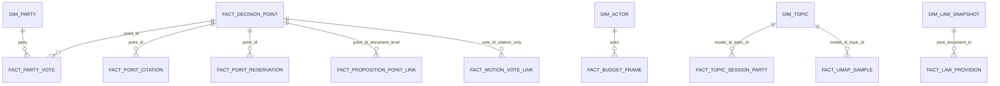

# Gold semantic model

The portfolio serves a **static, versioned gold layer** at `public/data/gold/`. It is rebuilt from the checked-in Parliament, budget, language, JobTech, Allegoria and RFC exports with `python scripts/build-gold.py`. It requires no live API or database. `semantic-model.json` is the machine-readable contract: table paths, row counts, observed column types, grains, primary keys, relationships, metric definitions, source hashes and output hashes.

## Layers and ownership

| Layer | Location | Role |
| --- | --- | --- |
| Source / bronze | `public/data/politics/parliament/`, `data/allegoria/` | Original exported snapshots and offline law documents; keep for audit. |
| Curated / silver | `public/data/politics/decisions/`, `public/data/politics/laws/`, `public/data/debates/budgets/`, `public/data/reports/`, `public/data/jobs/` | Parsed, corrected or indexed material. The exact-year budget correction lives here. |
| Gold facts and dimensions | `public/data/gold/tables/` | One explicit grain and key per table. No double-counting the source partitions or v1/v2 law overlap. |
| Gold presentation marts | `public/data/gold/marts/` | Small, stable JSON contracts consumed by the site; document and transcript details remain lazy-loaded from their curated source shards. |

**Build order:** regenerate upstream political and report exports when sources change, then run the gold builder and validator. A source hash mismatch causes validation to fail until gold is rebuilt. Gold JSON is committed so the static site builds without Python in its deployment environment.

```powershell
python scripts/build-gold.py
python scripts/validate-gold.py
npm run build
npm run test:e2e
```

## Main grains and keys

| Table | Rows in current snapshot | Grain / primary key |
| --- | ---: | --- |
| `dim_party` | 9 | `party`; eight parties in imported roll calls plus historical NYD in speech topics |
| `dim_actor` | 9 | `actor`; eight party proposers and separate collective `GOV` |
| `dim_session` | 33 | `session` |
| `dim_expenditure_area` | 27 | `expenditure_area`; fact rows preserve historical names |
| `dim_topic` | 52 | `model_id + topic_id`; legacy and current clusters are separate |
| `dim_law_snapshot` | 516 | `pool + document_id`; v1/v2 overlap |
| `fact_decision_point` | 4,407 | `point_id`; includes points without a roll call |
| `fact_party_vote` | 11,488 | `vote_id + party`; exactly eight party rows per 1,436 imported roll calls |
| `fact_point_citation` / `fact_point_reservation` | 18,505 / 7,503 | Stable per-point synthetic row ID; both link on `point_id` |
| `fact_speech_vote_candidate` | 933 | `vote_id + party + speech_id`; retrieval candidate only |
| `fact_motion_vote_link` | 5,367 | `vote_id + motion_id`; citation, not the motion's outcome |
| `fact_proposition_point_link` | 393 | `point_id + proposition_id`; document-level evidence only |
| `fact_law_mention_candidate` | 21 | `speech_id + sfs_document_id`; unverified lexical match |
| `fact_budget_frame` | 1,104 | `session + actor + expenditure_area`; corrected year selection |
| `fact_budget_outturn` | 783 | `budget_year + expenditure_area`; no automatic historical-area join |
| `fact_language_area` | 10,368 | `corpus + method + session + party + expenditure_area` |
| `mart_budget_language_gap` | 2,700 | Same language grain, **only** where a party has all 27 budget areas |
| `fact_job_month_role` | 192 | `month + role`; unique ad IDs, not hires |
| `fact_topic_session_party` | 4,285 | `model_id + session + party + topic_id` |
| `fact_umap_sample` | 14,800 | `model_id + chunk_id`; sample points, not a population count |
| `fact_law_provision` | 20,788 | `pool + document_id + provision_id`; source text is fetched through its snapshot shard |

All 31 table schemas, including the smaller job, activity, RFC and precomputed vote-measure tables, are in [`semantic-model.json`](../public/data/gold/semantic-model.json). The broader physical source inventory is in [the data dictionary](data-dictionary.md).

## Joins and measure semantics



- **Party position** is the largest recorded yes/no/abstain member-vote group for that party and roll call. This normalizes a damaged `Avstår` source label without changing vote counts. A yes refers to the *committee proposal*, which may reject a cited motion.
- **Party agreement** is same yes/no position divided by roll calls where both parties recorded yes/no. Abstentions are excluded. The published ordered-party matrix contains its numerator and denominator.
- **Cohesion** is the sum of each party's largest cast-vote group per roll call divided by all its cast member votes. **Recorded attendance** is cast votes divided by cast plus recorded absences. Pairing arrangements are unknown.
- **Budget–language difference** is `keyword_share_pct - budget_share_pct` in percentage points, keyed by session, party and expenditure area, *plus* a chosen corpus and matching method. It excludes incomplete party frames and missing party proposals. It is descriptive language attention, not support, intention or causal influence; speeches can postdate proposals.
- **Topic share** belongs to one named model run. Never join old and new topics on `topic_id` alone. UMAP is a deterministic sample with axes that have no direct political meaning.
- **Law direction** has no validated vote→versioned-provision→reviewed-annotation chain. The semantic model explicitly marks `validated_vote_direction_pairs` unavailable at zero; no tightening/loosening party score is published.

The frontend reads the gold vote, budget, job, UMAP and RFC marts. Original member votes, citations, law text and full speeches are loaded on demand from their versioned source files. This keeps the initial interface responsive while preserving drill-down evidence.

## Refresh and checks

`build-gold.py` is deterministic: it writes no wall-clock build timestamp. It refuses duplicate or missing primary keys, unknown parties, orphaned vote points, incomplete eight-party roll calls, orphaned citations/reservations, unknown topic/model pairs and provisions without law snapshots. `validate-gold.py` independently checks source/output hashes, every table's declared key and row count, key relationships, party positions, corrected budget arithmetic, eligible budget-language joins, law provision totals and monthly/yearly job-ad reconciliation. Source-text hashes normalize CRLF to LF across operating systems; checked-in gold JSON is pinned to LF.

Gold keeps **facts, dimensions and marts distinct**. Do not add their row counts together: marts are materialized views of the facts. Legacy source exports stay available for reproducibility but are not interchangeable with the corrected and versioned gold tables.
