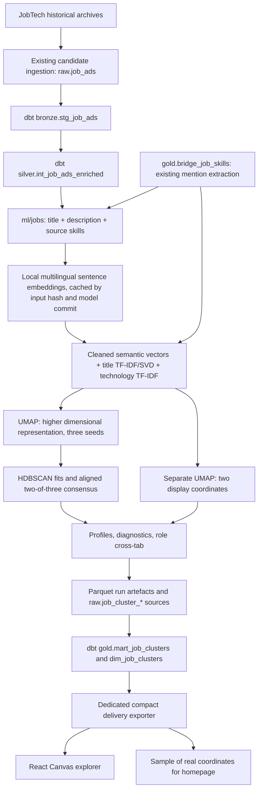

# Semantic structure of selected Swedish tech advertisements

The question is whether natural groups in advertisement language match the four existing
title-based families: Data Engineer, Analytics Engineer, Data Scientist and Software Developer.
This is **not** a model of the entire Swedish labour market, a count of hires, or a validated
occupational taxonomy. The all-occupation market report remains a separate product.

## Architecture and ownership



`ml/jobs/` extends the existing separate ML environment. Ingestion, role classification,
skill extraction and dbt remain in `platform/`; React consumes delivery. Python never
creates gold marts. The three `raw.job_cluster_*` tables are the ML-to-dbt boundary, imported
transactionally only after all coordinates and probabilities validate.

Cluster dbt models and their tests are opt-in through `job_clusters_enabled`. An ordinary
portfolio build does not require model weights or an ML warehouse. Existing reports and
data exports are not regenerated or replaced by this analysis.

## Selection and provenance

The loader queries `silver.int_job_ads_enriched`, retains precisely the four existing role
families and excludes empty descriptions. It uses `gold.bridge_job_skills` without copying
the extraction regexes. Role, seniority, publication year, region and employment type are
metadata and never enter the embedding input. Required skill labels supplied by JobTech
are included in addition to the existing detected mentions.

The published run (`efd2e318dc1621b2`) reads the **official 2022–2025 archives**, loaded with
the existing ingestion: 3,392,438 raw records and 87,287 retained candidates. dbt
classification and nonempty descriptions leave 35,861 analysis advertisements with 26,104
distinct input texts. The first run used the 2025 archive alone (6,123 ads). The candidate
universe is broader than the classified universe because candidate retention also uses
occupation matches and dbt applies title exclusions.

Archives: `https://data.arbetsformedlingen.se/annonser/historiska/<year>.jsonl.zip` for 2022,
2023, 2024 and 2025; each month's hash is in the coverage ledger.

SHA-256: `43499d2835b607f47e9641443e160bfcab26816c4f04fa17e87bb52b48ce79c6`

The archive includes publication-date spillover. A publication-year filter outside 2025
does **not** imply a complete additional annual archive. The delivery manifest includes
the archive coverage ledger, source hashes and whether a hash sample was requested.
Earlier archives can be appended with the existing ingestion and the same analysis rerun.
No fixture data can pass the analysis loader.

## Embeddings and reproducibility

Default model: `sentence-transformers/paraphrase-multilingual-MiniLM-L12-v2`.
It is a local multilingual model producing 384-dimensional sentence/paragraph embeddings;
its relatively small size and multilingual training make it a practical Swedish/English
baseline. See the [model card](https://huggingface.co/sentence-transformers/paraphrase-multilingual-MiniLM-L12-v2)
and [multilingual model documentation](https://github.com/huggingface/sentence-transformers/blob/main/docs/sentence_transformer/pretrained_models.md).
No paid API is called and no advertisement text is sent to a model service.

The model has a short token window. The implementation divides each complete semantic input
into token-sized chunks, embeds them locally, computes a token-weighted mean and normalises
that vector. This avoids silently retaining only the beginning of a long advertisement.
Mean pooling can still overemphasise company boilerplate and dilute individual requirements;
the model is a baseline, not a model validated specifically on Swedish recruitment text.

Input whitespace and skill order are normalised; languages and spelling are retained.
SHA-256 covers the text representation version and exact normalised input. The model's
Hub commit is resolved before cache lookup. Cache identity includes that commit and the
chunking representation. One vector is stored per distinct text; duplicate ads reuse it.

`warehouse/ml/jobs/embeddings-<identity>.parquet` stores job ID, text hash, model/revision,
representation, vector and timestamp. Batch checkpoints are atomically replaced, so an
interrupted run resumes. Warehouse, weights and source text remain gitignored.

Each run stores assignments, profiles and `report.json` under `warehouse/ml/jobs/runs/`.
Its identity incorporates text, delivered metadata, parameters, dependency versions,
implementation hash and coverage. The report records the resolved model commit, seed,
dependency versions, cache reuse and diagnostics. Fixed seed is reproducible within that
environment; different library versions or hardware can change the fitted space and IDs.
Cluster IDs are run-specific, not persistent occupational identifiers.

## UMAP and HDBSCAN

The current defaults, selected after feature ablations and consensus checks, are cosine
UMAP with 60 neighbours, 10 dimensions and `min_dist=0` for
clustering, and an independent 2D UMAP with `min_dist=.08` for display. HDBSCAN operates on
the **10-dimensional space**, using Euclidean distance there, `min_cluster_size=600` (100 in
the 2025-only run; six times the ads, six times the minimum),
`min_samples=3`, and eom selection. Aligned fits at seeds 42/43/44 assign a group only
when two agree. Noise (`cluster_id=-1`) is retained. The input combines cleaned semantic
text, title patterns and detected technology mentions with weights .65/.15/.20. See
[feature and ensemble findings](job-clustering-ensemble.md) for the 192-fit ablations,
disjoint-seed check, limitations and exact reproduction commands. The earlier 417-candidate
embedding-only search remains available as a baseline with explicit parameters.
Each of these settings is exposed by the command-line interface.

See [UMAP's clustering guide](https://umap-learn.readthedocs.io/en/latest/clustering.html).
UMAP can alter density and manufacture apparent separation. Display axes have no
interpretable units, and global geometry is not a calibrated measure of similarity or
causality. Year filtering hides points in the same fitted space; it never refits UMAP.

## Profiles and evaluation

Profiles contain counts, shares, role cross-tabs, title frequencies, seniority shares,
regions, years, smoothed skill lift and high-membership representative advertisements.
The dbt cluster dimension joins existing employer metadata to show the five largest
employer shares. A majority from one employer triggers an explicit warning in the profile.
Skill lift is compared against the entire analysis dataset, with minimum support and a
minimum lift of 1.5 and 15% within-group support for labels. Weak skill/title differentiation is labelled as a mixed
tech group instead of suggesting a precise occupation. Skills are mentions, including
optional or negated mentions; seniority remains the existing title-rule approximation.
For single fits, membership describes the HDBSCAN fit, not the truth of the label.
For consensus, the delivered support is the agreeing vote fraction (2/3 or 1, zero for noise).
Neither is a calibrated occupational-label probability.

Diagnostics include cluster counts and sizes, noise share, mean membership, silhouette
in both the clustering representation and the original embeddings (cosine), excluding noise,
trustworthiness of the display against
cosine embedding neighbours, and adjusted Rand index/cross-tabs against existing roles.
The fused-feature map also reports trustworthiness against its own feature neighbours;
the original-text diagnostic remains separate.
Silhouette is null when not defined. Expensive pairwise diagnostics use a deterministic
sample capped at 1,500 rows, and the sample size is reported.

`--compare` reruns two alternatives: half the neighbour count and half the minimum cluster
size. These are sensitivity checks, not an automatic search for the prettiest picture.
The headline result and parameter comparisons are recorded in delivery, and the website
shows the role cross-tab alongside the map. The measured results are in the generated run
report, [the parameter sweep](job-clustering-sweep.md) and [the feature
ensemble](job-clustering-ensemble.md).

Repeated advertisements are distinct records, so recruitment templates and employer
language can create dense groups. Ad distribution is also highly imbalanced across roles;
Analytics Engineer has little support in this archive. A future employer-grouped and
template-deduplicated sensitivity study would help distinguish technology from wording.
The previous embedding-only sweep configuration was also checked at seeds 43 and 44. Agreement is reported
both for all rows including noise and for rows assigned by both fits; the latter covers
only 42.6–45.9% of the full dataset and must not be presented as stability of every ad.
The current ensemble's disjoint seed check covers an 80.94% common assigned core;
see [ensemble findings](job-clustering-ensemble.md) for both all-row and core agreement.
Cross-year or employer-grouped stability remains untested.

## Parameter sweep

`python -m ml.jobs.sweep` runs offline against the pinned embedding cache, without changing
the database or delivery. It searches neighbours 10/30/60, dimensions 5/15 and clustering
`min_dist` 0/.1, plus the initial 30/15/.05 representation. Each representation tests
minimum cluster sizes 20/30/60/100, minimum samples 3/5/10/20 and eom/leaf selection;
the original 50/10/eom configuration is included separately: **417 candidates**.

UMAP representations and HDBSCAN hierarchies are reused, with resumable candidate checkpoints.
Cosine silhouette in the original vectors and Euclidean silhouette in UMAP use the same
fixed 1,200-ad diagnostic sample, excluding noise. Reports include largest-group share,
employer-majority share and membership. An exploratory ranking penalises noise, a dominant
cluster and employer-majority groups; it is not an accuracy metric or automatic promotion.

Profiles and seed review led to choosing the 25-group leaf configuration instead of the
highest-ranked 84-group fragmentation. See [sweep findings](job-clustering-sweep.md) and
the [complete candidate table](job-clustering-sweep.csv). `--review <candidate.json>` checks
two additional seeds and saves profiles; `--sweep-candidate <candidate.json>` in the pipeline
requires matching corpus, metadata, model, parameters and dependency versions, then verifies
the recomputed assignments against the reviewed candidate before writing raw tables.

## Rerun on Windows

Run from the repository root. Install the existing platform and ML requirements in their
respective environments if needed. No new web framework or embedding API is required.

```powershell
# Existing ingestion, using any desired complete historical years.
python platform/ingest/jobtech/ingest_history.py --years 2025 `
  --database warehouse/jobtech/history.duckdb --directory warehouse/raw/jobtech/history

$env:PORTFOLIO_DB = "$PWD/warehouse/jobtech/history.duckdb"
python -m dbt.cli.main seed --project-dir platform --profiles-dir platform `
  --select role_patterns role_classification_patterns technology_patterns
python -m dbt.cli.main build --project-dir platform --profiles-dir platform --select tag:jobs

ml/.venv/Scripts/python.exe -m ml.jobs.feature_experiment
ml/.venv/Scripts/python.exe -m ml.jobs.feature_experiment --review `
  warehouse/ml/jobs/feature-experiments/ff2856dc431d0f8c/balanced-n60-d10-c100-ms3-eom.json
ml/.venv/Scripts/python.exe -m ml.jobs.feature_experiment --consensus-check `
  warehouse/ml/jobs/feature-experiments/ff2856dc431d0f8c/balanced-n60-d10-c100-ms3-eom.json
ml/.venv/Scripts/python.exe -m ml.jobs.pipeline `
  --feature-candidate warehouse/ml/jobs/feature-experiments/ff2856dc431d0f8c/balanced-n60-d10-c100-ms3-eom.json `
  --revision e8f8c211226b894fcb81acc59f3b34ba3efd5f42

python -m dbt.cli.main build --project-dir platform --profiles-dir platform `
  --vars '{job_clusters_enabled: true}' --select tag:job_clusters
python platform/publish/export_job_clusters.py

ml/.venv/Scripts/python.exe -m pytest ml/jobs/tests -q
npx playwright test --config frontend/playwright.config.ts frontend/tests/clusters.spec.ts
npm run build
```

`--database` and `ML_JOBS_DB` override the ML/export database. `--model` and `--revision`
choose weights; `--neighbors`, `--dimensions`, `--cluster-min-dist`, `--visual-min-dist`,
`--min-cluster-size`, `--min-samples`, `--selection-method` and `--seed` expose parameters.
`--limit` requests an explicit deterministic SHA-256 sample, marked as sampled in delivery.
The published run uses all 35,861 eligible rows and no limit. It gives 10 groups, 16.7 % of the ads in none, and the largest group holds 27.6 %. The feature ablations and the parameter sweep were run on the 2025 corpus; they have not been repeated on 2022–2025, so this run applies the chosen settings without a new review file. A new corpus or dependency
version produces a different sweep directory; use its printed path instead of this run's path.

The exporter writes immutable JSON point shards of 5,000 rows, an aggregate manifest and
a 1,500-point real-coordinate homepage sample. It verifies run consistency and reconciles
row counts before export. Each point includes title and skill mentions for interaction,
never descriptions or embeddings. The full explorer is a separately loaded Canvas module;
the homepage requests only the compact sample and the political project preview.

The explorer provides role/cluster/seniority/year modes, a year selector, pointer details,
keyboard point traversal (arrows, Home/End, Enter and Escape), cluster selection and an
HTML cross-tab/profile fallback. Legend text and point details accompany colour encoding.
Loading, missing-data, retry and reduced-motion behaviour are covered by browser tests.
