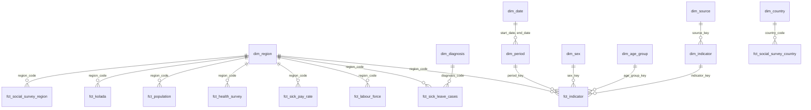

# Välfärd: hur Sverige mår — datamodell

Fem öppna källor i ett star schema med gemensamma nycklar, så att jobb, arbetsliv, hälsa,
mående och tillit kan läsas mot varandra per region och period. Urvalet av indikatorer
lutar sig mot SCB:s och regeringens **Nya mått på välfärd** (ekonomiska, sociala och
miljömässiga mått); `dim_indicator.welfare_dimension` anger vilken grupp ett mått hör till.

Allt är beskrivande. Modellen visar samvariation mellan regioner och över tid, aldrig
orsakssamband.

Vilken tabell som passar vilket syfte, hur varje mått får aggregeras och hur data läses från
Power BI, Databricks eller Python står i [analysguiden](analysis-guide.md).

## Källor

| Källa | Vad | Nivå | Period |
|---|---|---|---|
| SCB, AKU | Sysselsättningsgrad, arbetslöshet, arbetskraftstal med felmarginal | Län (år, kvartal), riket (månad, kön, ålder) | 2001– |
| SCB, befolkning | Folkmängd 31 december | Riket, län, kommun × kön | 1968– |
| Försäkringskassan | Sjukpenningtal 2.0; startade sjukfall per diagnoskapitel; stressdiagnoser (F43) per län; pågående sjukfall per län och ålder | Kommun, län, riket × månad | 1994–, sjukpenningtal 2.0 från 2021 |
| Folkhälsomyndigheten | Nationella folkhälsoenkäten: psykisk hälsa, allmän hälsa, sociala relationer och tillit, med 95 % konfidensintervall | Län (fyra år sammanslagna), riket per ålder och år | 2004– |
| European Social Survey | Tillit, förtroende för institutioner, livstillfredsställelse, lycka, hälsa, värderingar | 39 länder; Sverige även per NUTS2 | Omgång 1–11 (2002–2024) |
| Kolada | 13 nyckeltal: arbetslöshet, sysselsättning, sjukpenningtal, ohälsotal, inkomst, ekonomiskt bistånd, psykisk påfrestning, tillit, valdeltagande, våldsbrott, gymnasiebehörighet, invånare | Kommun, län, riket × kön | 1990– |

Källor och villkor finns i `dim_source`. ESS-mikrodata stannar i det lokala warehouset;
bara viktade aggregat lämnar det.

## Lager

```
platform/ingest/{scb,fohm,fk,ess,kolada}   hämtar till warehouse/raw/<källa>/, med _manifest.jsonl
models/bronze/welfare/stg_*                 en rad per källpost, typad, inget annat
models/silver/welfare/int_welfare_*         källans koder översatta till de gemensamma nycklarna
models/gold/shared/dim_*                    gemensamma dimensioner
models/gold/welfare/fct_*, mart_*           fakta på deklarerad grain, samt en översikt per län och år
```

Varje hämtad fil har en rad i `warehouse/raw/<källa>/_manifest.jsonl`: URL, metod,
frågekropp, tidpunkt, SHA-256 och storlek. En hämtning som ger identiska bytes skriver inte
om filen.

## Star schema



Alla fakta delar samma nycklar mot `dim_period`, `dim_sex` och `dim_age_group`; diagrammet
visar dem bara för `fct_indicator`.

### Gemensamma nycklar

| Nyckel | Värden | Kommentar |
|---|---|---|
| `region_code` | `00` riket, `01`–`25` län, `0114` kommun, `SE11`–`SE33` NUTS2, `0050` AKU-aggregat | SCB:s koder. `dim_region` ger län, NUTS2 och Kolada-id för varje rad |
| `period_key` | `2024`, `2024-Q1`, `2024-03`, `2021-2024`, `ESS11` | `dim_period` ger typ, start- och slutdatum och `reference_year` |
| `sex_key` | `T`, `K`, `M` | Varje källas kodning översätts i silver |
| `age_group_key` | `15-74`, `16-84`, `65+`, `ALL` … | Som källan publicerar dem. Band från olika källor jämförs inte |

### Fakta och grain

| Tabell | Grain | Mått |
|---|---|---|
| `fct_labour_force` | region × period × kön × ålder × serietyp × status | tusental, felmarginal, andel, felmarginal |
| `fct_population` | region × år × kön | folkmängd |
| `fct_sick_pay_rate` | region × månad × kön × ålder | sjukpenningtal, antal försäkrade |
| `fct_sick_leave_cases` | falltyp × region × månad × kön × ålder × diagnos | antal, förändring mot året före |
| `fct_health_survey` | indikator × region × period × kön × ålder | andel, konfidensintervall, antal svar |
| `fct_social_survey_country` | indikator × land × omgång × kön × ålder | viktat medel, intervall, andel höga svar, antal |
| `fct_social_survey_region` | indikator × NUTS2 × omgång | som ovan, Sverige, omgång 5– |
| `fct_kolada` | indikator × region × år × kön | värde |
| **`fct_indicator`** | indikator × region × period × kön × ålder | värde, intervall, urval |
| `mart_county_year_overview` | län × år | arbetslöshet, sjukpenningtal, stressfall per 1 000, psykisk påfrestning, folkmängd |

`fct_indicator` samlar rubrikvärdet från varje källa på en och samma grain. Det är tabellen
att koppla över områden; källfakta behåller detaljen.

## Exempel

Hänger regional arbetslöshet ihop med sjukskrivning och upplevd hälsa? Beskrivande, per län:

```sql
select region_name, year, unemployment_rate_pct, unemployment_rate_moe,
       sick_pay_rate_days, stress_cases_per_1000, serious_mental_strain_pct
from gold.mart_county_year_overview
where year = 2024
order by unemployment_rate_pct desc;
```

Alla mått inom ett område för ett län, oavsett källa:

```sql
select i.indicator_name, i.source_key, p.period_label, f.value, f.ci_low, f.ci_high
from gold.fct_indicator f
join gold.dim_indicator i using (indicator_key)
join gold.dim_period p using (period_key)
where i.domain = 'mental_halsa' and f.region_code = '01' and f.sex_key = 'T'
order by i.indicator_name, p.start_date;
```

## Det man måste veta innan man läser siffrorna

- **Folkhälsomyndighetens länsresultat är fyra år sammanslagna** (`2021-2024`), eftersom ett
  års urval per län är för litet. De jämförs mot andra källor via `reference_year` (sista
  året), inte som ettårsvärden.
- **SCB:s folkmängd för 2025 är skyddad med cell key method.** Varje cell har ett litet
  slumpmässigt brus, så länen summerar inte exakt till riket. `is_perturbed` markerar dem;
  testet tillåter högst 0,01 % avvikelse för de åren och kräver exakt summa för övriga.
- **ESS10 i Sverige samlades in med självifyllnad**, inte intervju. Tilliten faller då till
  5,3 från 6,0–6,3 i alla andra omgångar. Det är sannolikt en metodeffekt, inte en verklig
  förändring. `survey_mode` finns på varje ESS-rad.
- **ESS-intervallen är för smala.** De bygger på Kish effektiva urvalsstorlek och bortser
  från klustring och stratifiering. Vikt: `pspwght` (rätt vikt inom ett land).
- **ESS-regioner:** NUTS3 i omgång 5–8 och NUTS2 från omgång 9, båda förda till NUTS2.
  Omgång 1–4 har en nationell regionkod som inte är dokumenterad nog att översätta; de
  omgångarna finns bara för riket.
- **Försäkringskassan undertrycker små tal** (`rojd`). De blir NULL med en flagga, aldrig noll.
- **F43 ligger inuti F00–F99** i `dim_diagnosis`. Summera aldrig de två.
- **Sjukpenningtal 2.0 är ett rullande tolvmånadersmått**; decembervärdet motsvarar
  kalenderåret. Det finns från 2021. Sjukpenningtal 1.0 med längre historik finns via Kolada.
- **Åldersband skiljer sig mellan källor** (AKU 15–74, FK 15–69, Folkhälsomyndigheten 16–84).
  De hålls isär i `dim_age_group` och jämförs bara med samma band.
- **Kolada** återpublicerar andra källors siffror; ursprungskällan står i nyckeltalets
  beskrivning i `dim_indicator`.

## Köra

```bash
npm run welfare          # hämta alla fem källor, sedan dbt build --select tag:welfare
npm run welfare:fetch    # bara hämta
npm run welfare:build    # bygga och testa från filerna som redan finns
```

dbt körs från `platform/`, där profilens databas `../warehouse/portfolio.duckdb` och
bronze-sökvägen `../warehouse/raw` pekar rätt. `PORTFOLIO_DB` och `PORTFOLIO_RAW` skriver
över dem.

Testerna: primärnyckel på varje dimension, grain på varje faktatabell, relation från varje
nyckel till sin dimension, samt avstämning mot publicerade värden (AKU 2025: arbetslöshet
8,8 %, sysselsättningsgrad 69,0 %), att länens folkmängd summerar till rikets, att andelar
ligger mellan 0 och 100 och att varje intervall innehåller sin skattning.
