# DrugCombDB synergy – results report

_Generated by `drugsyn report` – do not edit by hand._

## Data provenance

| source | file | release | MB | sha256 | recorded_at |
| --- | --- | --- | --- | --- | --- |
| depmap | CRISPRGeneEffect.csv | DepMap 24Q4 Public | 428.700 | 3d8f3ec6dbf2… | 2026-09-24T04:10:45+00:00 |
| depmap | Model.csv | DepMap 24Q4 Public | 0.600 | b7a0c1385e6c… | 2026-09-24T04:10:01+00:00 |
| depmap | OmicsExpressionProteinCodingGenesTPMLogp1.csv | DepMap 24Q4 Public | 506.600 | 2a71dc94110e… | 2026-09-24T04:10:31+00:00 |
| depmap | OmicsSomaticMutationsMatrixDamaging.csv | DepMap 24Q4 Public | 147.700 | 1b33be5c3beb… | 2026-09-24T04:10:50+00:00 |
| drugcombdb | drug_chemical_info.csv | nan | 0.300 | c5331cb8e5ec… | 2026-09-24T03:43:23+00:00 |
| drugcombdb | drug_protein_links.tsv | nan | 745.000 | 309c0af55cef… | 2026-09-24T04:09:59+00:00 |
| drugcombdb | drugcombs_response.csv | nan | 685.900 | 3f67aab5efc4… | 2026-09-24T03:56:50+00:00 |
| drugcombdb | drugcombs_scored.csv | nan | 32.300 | e821d3662703… | 2026-09-24T03:43:23+00:00 |

## Dataset at a glance

| metric | value |
| --- | --- |
| combinations | 3.965e+05 |
| drug_pairs | 6.757e+04 |
| drugs | 4188 |
| cell_lines | 119 |
| lineages | 15 |
| mean_zip | -1.58 |
| share_synergistic | 0.0544 |
| share_antagonistic | 0.0945 |
| share_with_structures | 0.9975 |
| share_with_rna | 0.7171 |

## Data engineering

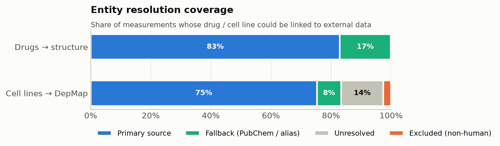

### Data-quality checks

| check | passed | detail |
| --- | --- | --- |
| fact grain is unique (drug_1, drug_2, cell_key, study) | True | 0 duplicates |
| drug pairs are canonically ordered | True | nan |
| no self-combinations | True | nan |
| ZIP has no missing values | True | 0 missing |
| every drug_key exists in dim_drug | True | nan |
| every cell_key exists in dim_cell | True | nan |
| dim_drug key is unique | True | nan |
| dim_cell key is unique | True | nan |
| rows with structures for both drugs | True | 99.8% |
| rows with DepMap RNA for the cell line | True | 71.7% |

## Exploratory analysis

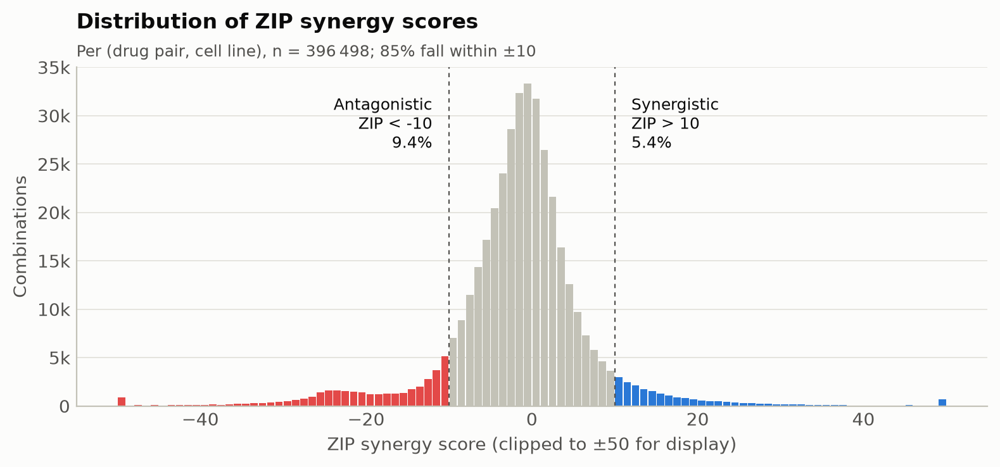

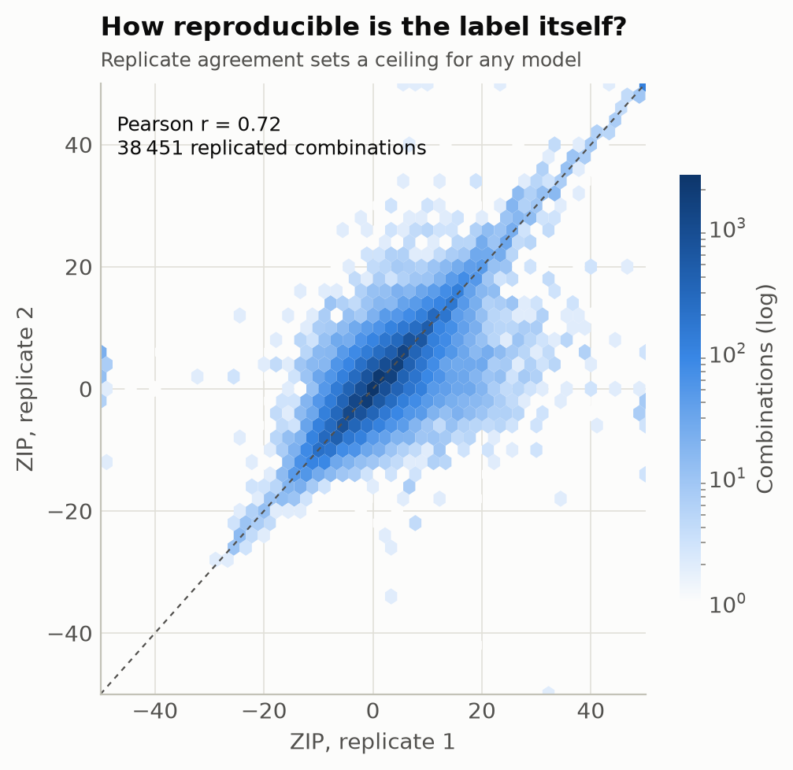

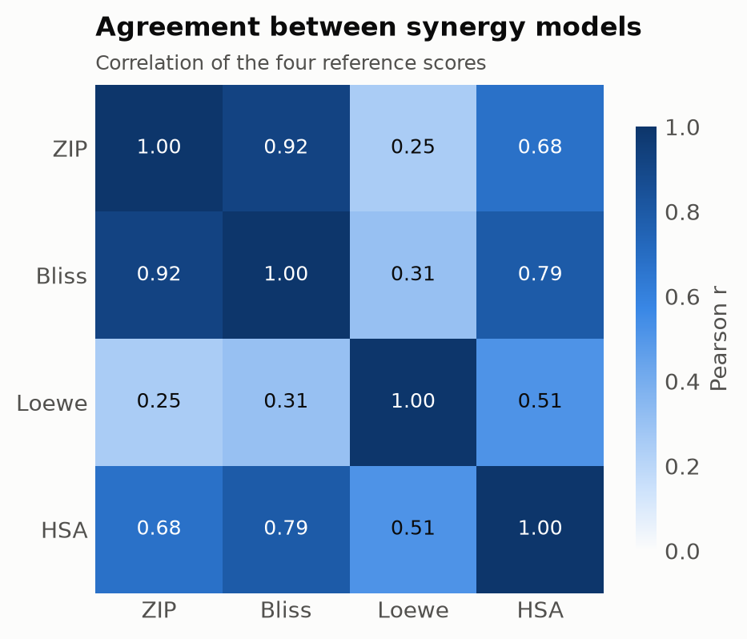

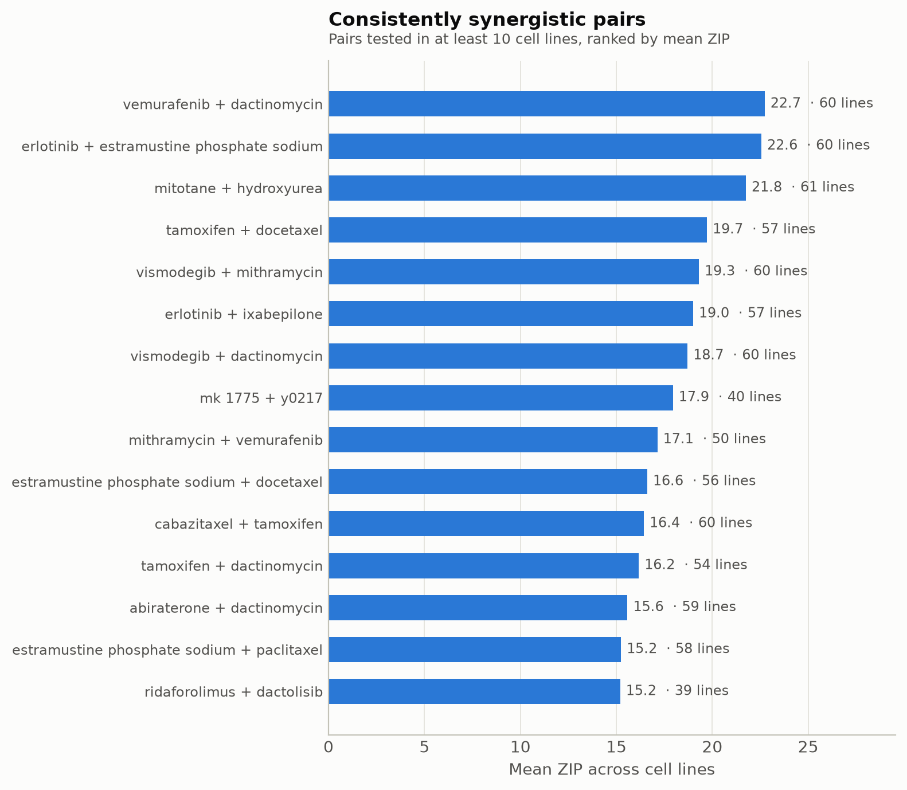

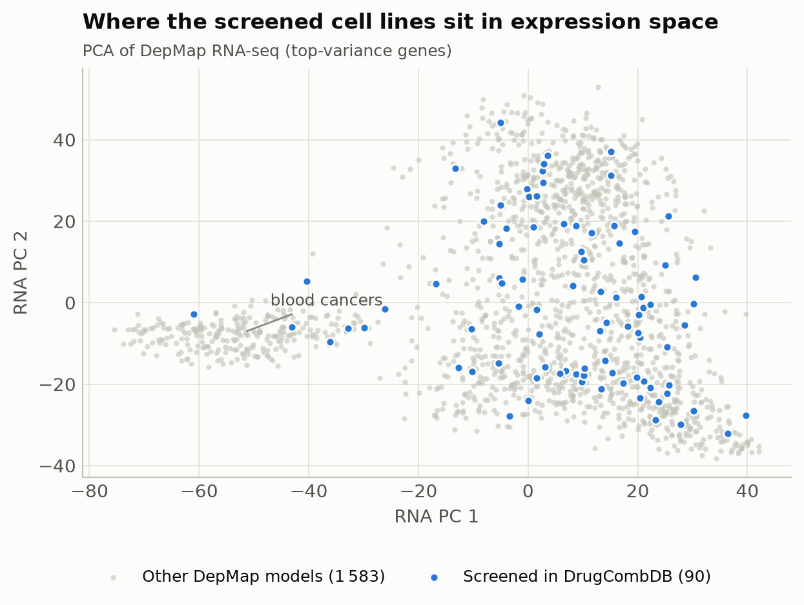

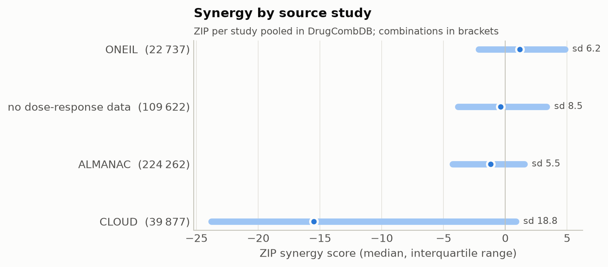

## Modelling

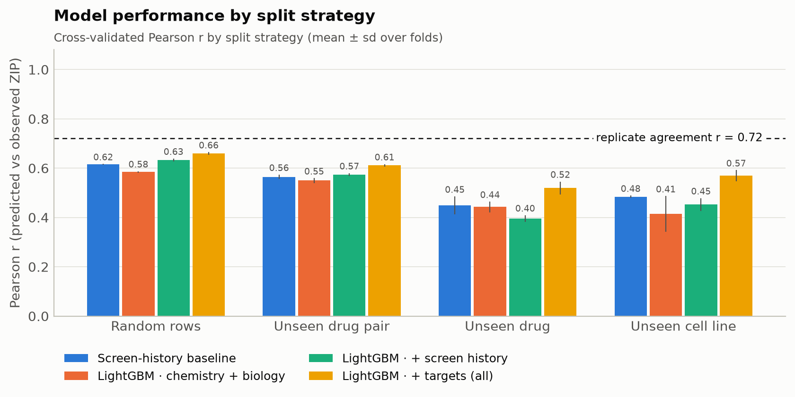

| split | model | pearson | spearman | rmse | r2 | auprc_synergy | prevalence_synergy |
| --- | --- | --- | --- | --- | --- | --- | --- |
| Random rows | Global mean | nan | nan | 9.379 | -0.000 | 0.054 | 0.054 |
| Random rows | Screen-history baseline | 0.615 | 0.635 | 7.397 | 0.378 | 0.421 | 0.054 |
| Random rows | LightGBM · chemistry + biology | 0.585 | 0.580 | 7.614 | 0.341 | 0.396 | 0.054 |
| Random rows | LightGBM · + screen history | 0.633 | 0.662 | 7.266 | 0.400 | 0.476 | 0.054 |
| Random rows | LightGBM · + study | 0.632 | 0.662 | 7.269 | 0.399 | 0.476 | 0.054 |
| Random rows | LightGBM · + monotherapy | 0.662 | 0.727 | 7.028 | 0.438 | 0.500 | 0.054 |
| Random rows | LightGBM · + targets (all) | 0.660 | 0.727 | 7.049 | 0.435 | 0.501 | 0.054 |
| Random rows | LightGBM · all but screen history | 0.635 | 0.696 | 7.244 | 0.403 | 0.441 | 0.054 |
| Unseen drug pair | Global mean | nan | nan | 9.372 | -0.000 | 0.054 | 0.054 |
| Unseen drug pair | Screen-history baseline | 0.564 | 0.544 | 7.819 | 0.304 | 0.318 | 0.054 |
| Unseen drug pair | LightGBM · chemistry + biology | 0.550 | 0.519 | 7.830 | 0.302 | 0.330 | 0.054 |
| Unseen drug pair | LightGBM · + screen history | 0.574 | 0.560 | 7.687 | 0.327 | 0.335 | 0.054 |
| Unseen drug pair | LightGBM · + study | 0.571 | 0.555 | 7.704 | 0.324 | 0.332 | 0.054 |
| Unseen drug pair | LightGBM · + monotherapy | 0.613 | 0.660 | 7.423 | 0.373 | 0.373 | 0.054 |
| Unseen drug pair | LightGBM · + targets (all) | 0.612 | 0.658 | 7.425 | 0.372 | 0.371 | 0.054 |
| Unseen drug pair | LightGBM · all but screen history | 0.610 | 0.656 | 7.428 | 0.372 | 0.383 | 0.054 |
| Unseen drug | Global mean | nan | nan | 9.755 | -0.003 | 0.056 | 0.056 |
| Unseen drug | Screen-history baseline | 0.449 | 0.411 | 9.417 | 0.065 | 0.230 | 0.056 |
| Unseen drug | LightGBM · chemistry + biology | 0.442 | 0.390 | 8.745 | 0.194 | 0.227 | 0.056 |
| Unseen drug | LightGBM · + screen history | 0.396 | 0.374 | 9.094 | 0.129 | 0.230 | 0.056 |
| Unseen drug | LightGBM · + study | 0.405 | 0.380 | 9.079 | 0.132 | 0.233 | 0.056 |
| Unseen drug | LightGBM · + monotherapy | 0.520 | 0.560 | 8.402 | 0.256 | 0.258 | 0.056 |
| Unseen drug | LightGBM · + targets (all) | 0.520 | 0.554 | 8.454 | 0.246 | 0.256 | 0.056 |
| Unseen drug | LightGBM · all but screen history | 0.543 | 0.587 | 8.237 | 0.284 | 0.252 | 0.056 |
| Unseen cell line | Global mean | nan | nan | 6.615 | -0.054 | 0.054 | 0.054 |
| Unseen cell line | Screen-history baseline | 0.484 | 0.488 | 5.953 | 0.147 | 0.254 | 0.054 |
| Unseen cell line | LightGBM · chemistry + biology | 0.414 | 0.423 | 6.047 | 0.117 | 0.243 | 0.054 |
| Unseen cell line | LightGBM · + screen history | 0.453 | 0.424 | 5.776 | 0.196 | 0.255 | 0.054 |
| Unseen cell line | LightGBM · + study | 0.453 | 0.431 | 5.779 | 0.195 | 0.256 | 0.054 |
| Unseen cell line | LightGBM · + monotherapy | 0.571 | 0.610 | 5.335 | 0.314 | 0.272 | 0.054 |
| Unseen cell line | LightGBM · + targets (all) | 0.569 | 0.624 | 5.344 | 0.313 | 0.260 | 0.054 |
| Unseen cell line | LightGBM · all but screen history | 0.572 | 0.646 | 5.418 | 0.288 | 0.278 | 0.054 |

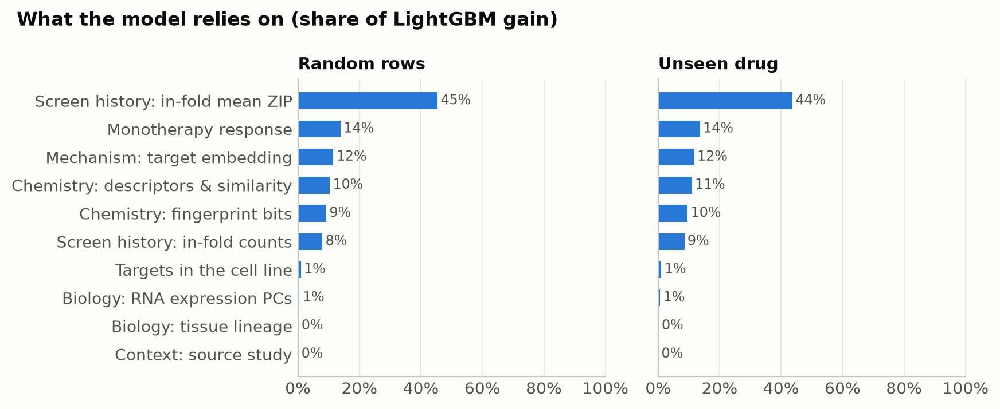

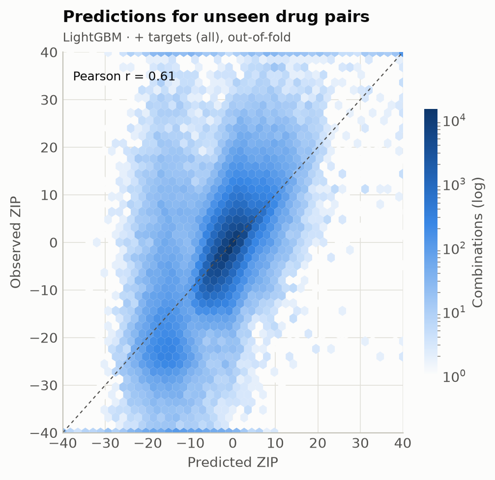

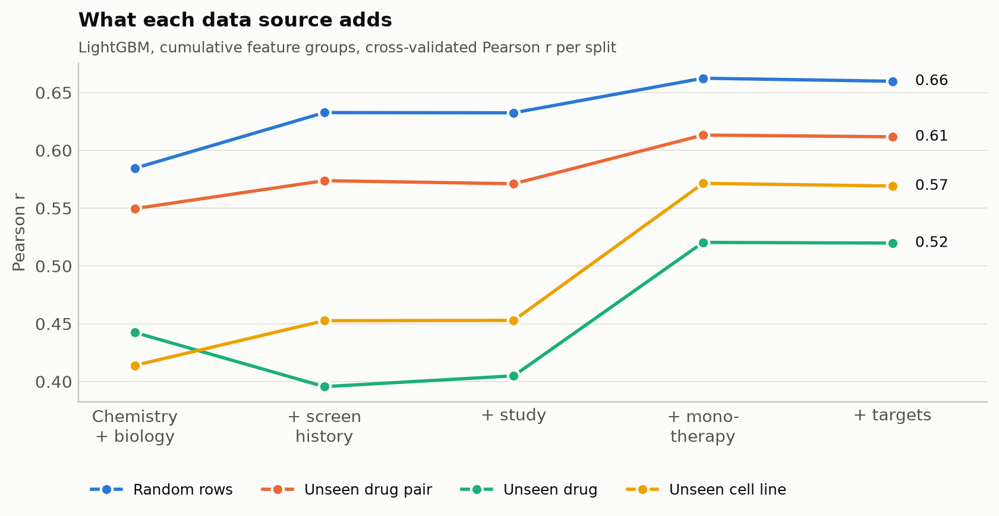

## Model diagnostics

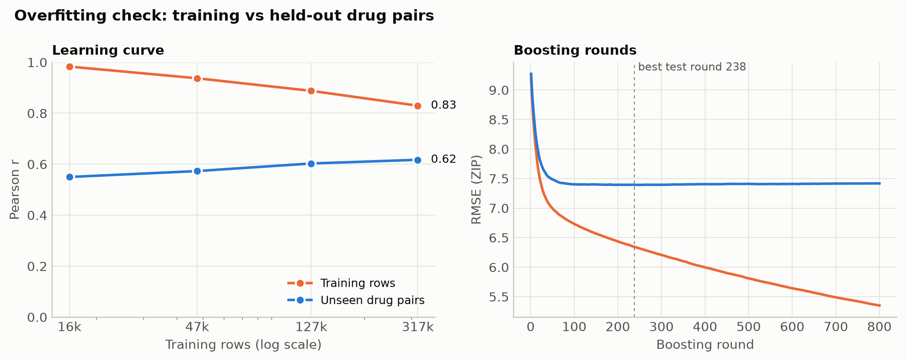

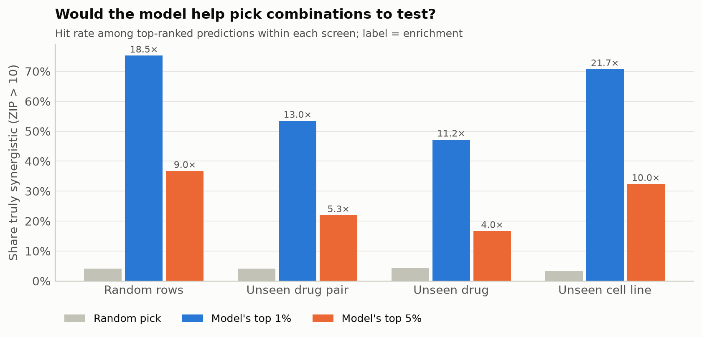

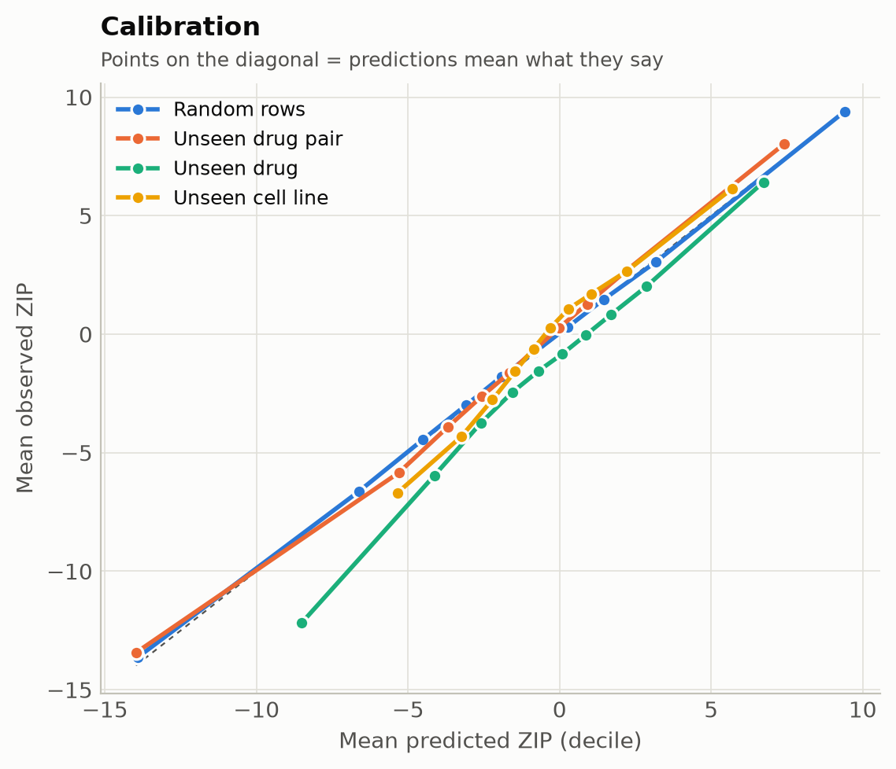

### Y-scramble (leakage check)

| scheme | labels | test_r |
| --- | --- | --- |
| cold_pair | shuffled | 0.002 |

### Performance by study

| scheme | study | model | n | pearson | rmse |
| --- | --- | --- | --- | --- | --- |
| random | ONEIL | history_ridge | 13683 | 0.721 | 4.401 |
| random | ONEIL | lgbm_all | 13683 | 0.764 | 4.006 |
| random | CLOUD | history_ridge | 23973 | 0.260 | 18.182 |
| random | CLOUD | lgbm_all | 23973 | 0.281 | 18.190 |
| random | ALMANAC | history_ridge | 134498 | 0.662 | 4.100 |
| random | ALMANAC | lgbm_all | 134498 | 0.794 | 3.317 |
| random | unknown | history_ridge | 65746 | 0.678 | 6.249 |
| random | unknown | lgbm_all | 65746 | 0.734 | 5.773 |
| cold_pair | ONEIL | history_ridge | 14079 | 0.614 | 4.977 |
| cold_pair | ONEIL | lgbm_all | 14079 | 0.640 | 4.958 |
| cold_pair | CLOUD | history_ridge | 23985 | 0.261 | 18.241 |
| cold_pair | CLOUD | lgbm_all | 23985 | 0.281 | 18.277 |
| cold_pair | ALMANAC | history_ridge | 135895 | 0.485 | 4.987 |
| cold_pair | ALMANAC | lgbm_all | 135895 | 0.666 | 4.106 |
| cold_pair | unknown | history_ridge | 66045 | 0.632 | 6.702 |
| cold_pair | unknown | lgbm_all | 66045 | 0.674 | 6.252 |
| cold_drug | ONEIL | history_ridge | 21021 | 0.468 | 5.657 |
| cold_drug | ONEIL | lgbm_all | 21021 | 0.454 | 5.665 |
| cold_drug | CLOUD | history_ridge | 45196 | 0.098 | 21.521 |
| cold_drug | CLOUD | lgbm_all | 45196 | 0.139 | 19.664 |
| cold_drug | ALMANAC | history_ridge | 230632 | 0.361 | 5.723 |
| cold_drug | ALMANAC | lgbm_all | 230632 | 0.567 | 4.570 |
| cold_drug | unknown | history_ridge | 103853 | 0.498 | 7.790 |
| cold_drug | unknown | lgbm_all | 103853 | 0.541 | 7.318 |
| cold_cell | ONEIL | history_ridge | 12826 | 0.390 | 6.340 |
| cold_cell | ONEIL | lgbm_all | 12826 | 0.510 | 5.779 |
| cold_cell | ALMANAC | history_ridge | 135429 | 0.542 | 4.712 |
| cold_cell | ALMANAC | lgbm_all | 135429 | 0.729 | 3.810 |
| cold_cell | unknown | history_ridge | 72424 | 0.403 | 7.662 |
| cold_cell | unknown | lgbm_all | 72424 | 0.398 | 7.308 |

### Enrichment of synergistic hits

| scheme | model | top_fraction | hit_rate | base_rate | enrichment |
| --- | --- | --- | --- | --- | --- |
| random | history_ridge | 0.010 | 0.631 | 0.041 | 15.464 |
| random | history_ridge | 0.050 | 0.308 | 0.041 | 7.554 |
| random | history_ridge | 0.100 | 0.192 | 0.041 | 4.718 |
| random | lgbm_all | 0.010 | 0.753 | 0.041 | 18.460 |
| random | lgbm_all | 0.050 | 0.367 | 0.041 | 9.010 |
| random | lgbm_all | 0.100 | 0.225 | 0.041 | 5.512 |
| cold_pair | history_ridge | 0.010 | 0.344 | 0.041 | 8.354 |
| cold_pair | history_ridge | 0.050 | 0.182 | 0.041 | 4.416 |
| cold_pair | history_ridge | 0.100 | 0.129 | 0.041 | 3.132 |
| cold_pair | lgbm_all | 0.010 | 0.535 | 0.041 | 13.000 |
| cold_pair | lgbm_all | 0.050 | 0.220 | 0.041 | 5.341 |
| cold_pair | lgbm_all | 0.100 | 0.150 | 0.041 | 3.643 |
| cold_drug | history_ridge | 0.010 | 0.274 | 0.042 | 6.471 |
| cold_drug | history_ridge | 0.050 | 0.147 | 0.042 | 3.489 |
| cold_drug | history_ridge | 0.100 | 0.113 | 0.042 | 2.667 |
| cold_drug | lgbm_all | 0.010 | 0.472 | 0.042 | 11.172 |
| cold_drug | lgbm_all | 0.050 | 0.167 | 0.042 | 3.952 |
| cold_drug | lgbm_all | 0.100 | 0.114 | 0.042 | 2.697 |
| cold_cell | history_ridge | 0.010 | 0.585 | 0.033 | 17.965 |
| cold_cell | history_ridge | 0.050 | 0.288 | 0.033 | 8.847 |
| cold_cell | history_ridge | 0.100 | 0.180 | 0.033 | 5.540 |
| cold_cell | lgbm_all | 0.010 | 0.707 | 0.033 | 21.728 |
| cold_cell | lgbm_all | 0.050 | 0.324 | 0.033 | 9.957 |
| cold_cell | lgbm_all | 0.100 | 0.200 | 0.033 | 6.133 |
