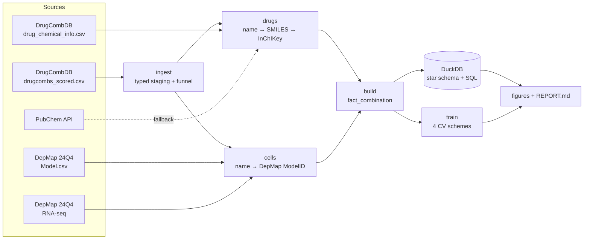

# DrugComb Synergy – from public screens to honest predictions

An end-to-end project on drug-combination synergy in cancer cell lines. It
covers data engineering, analysis and machine learning:

* **Data engineering:** a reproducible pipeline that downloads DrugCombDB and
  DepMap, resolves messy drug and cell-line names to canonical entities, and
  loads a star schema into DuckDB. It runs declarative data-quality checks and
  records the provenance (URL, release, SHA-256) of every input file.
* **Analytics:** SQL analyses and publication-style figures. How is synergy
  distributed, how reproducible is it, how does tissue context shift it, and
  how sparse is the screen?
* **Machine learning:** symmetric chemistry and biology features, strictly
  in-fold target statistics, and models evaluated under four split strategies
  of increasing difficulty. The evaluation reports how well the model
  generalises, not just how well it fits.

> **v2 is a rewrite.** The original school project lives in [`legacy/`](legacy/).
> The section [What changed since v1](#what-changed-since-v1) explains why.

All numbers and figures below come from running the pipeline
(`make all`). The full generated report is
[`reports/REPORT.md`](reports/REPORT.md), and the exact input files
(URL, release, SHA-256) are listed in
[`reports/data_manifest.json`](reports/data_manifest.json).

## Results at a glance

*DrugCombDB × DepMap 24Q4 Public, LightGBM, 3 folds per split strategy.*

| | |
|---|---|
| Raw measurements → modelling rows | 498 865 → **396 498** (drug pair × cell line × study) |
| Drug names → unique molecules | 5 347 → **4 188** (99.9 % of measurements have a structure; 83 % have known protein targets) |
| Cell lines matched to DepMap | 105 of 119 human lines (83 % of measurements); 3 malaria strains excluded |
| Source studies | ALMANAC 224k · CLOUD 40k · ONEIL 23k · no dose-response data 110k |
| Synergistic (ZIP > 10) / antagonistic (ZIP < −10) | 5.4 % / 9.5 % |
| Replicate agreement within a study (a ceiling for any model) | Pearson r = **0.72** |

**How well does it predict?** Best model per split strategy, compared with v2's
first version (chemistry + biology + screen history):

| Split | What it simulates | Before | **Now** | R² | Top-1 % hit rate |
|---|---|---|---|---|---|
| Random rows | Filling gaps in a screen | 0.63 | **0.66** | 0.44 | 75 % (18×) |
| Unseen drug pair | Proposing new combinations of known drugs | 0.57 | **0.61** | 0.37 | 54 % (13×) |
| Unseen drug | Adding a new compound | 0.40 | **0.54**¹ | 0.28 | 47 % (11×) |
| Unseen cell line | Moving to a new tumour model | 0.45 | **0.57** | 0.31 | 71 % (22×) |

Pearson r, cross-validated. The hit rate is the share of truly synergistic
combinations (ZIP > 10) among the all-features model's top 1 % within each
screen; the share among random picks is 3–4 %.
¹ Best without the screen-history features (see below).

**Is it overfitting?** It has high variance but is not harmfully overfit.
Train r is 0.83 against 0.62 on unseen pairs. However, held-out performance
still *rises* with more training data (0.55 → 0.62, figure below), and test
error is flat from boosting round ≈ 240 to 800 (RMSE 7.39 → 7.42). A
y-scramble run (same pipeline, shuffled labels) scores r = 0.002, so no label
information leaks into the features.

**What each data source adds (ablation):**

* **Monotherapy response is the biggest single gain:** +0.03 to +0.12 r
  depending on the split. It is the only feature group that describes how
  *this* cell line responds to *this* drug.
* **Screen history hurts on unseen drugs** (0.44 → 0.40). The in-fold means
  fall back to a global prior for a drug that has never been screened, and
  the model learns to trust them. Dropping them gives the best unseen-drug
  model (0.54).
* **Study as a feature adds nothing on top of history,** but it matters for
  the data: the CLOUD screen (one cell line, KBM-7) has median ZIP −15.5
  against −1.2 to +1.2 elsewhere, and it is where the model fails
  (r ≈ 0.28, RMSE 18).
* **Targets add mechanism, not accuracy.** The target embedding takes 12 % of
  the gain, but the total barely moves once monotherapy is in. It mostly
  re-encodes what the single-agent response already shows.
* **Calibration** is good for random, unseen-pair and unseen-cell splits. For
  unseen drugs the model is about 1 ZIP unit too optimistic in the middle of
  the range.

Caveat: monotherapy features come from the same screen as the combination.
The results therefore assume single-agent responses are measured before the
combination is predicted, which is the standard setting in combination
screening (e.g. the AZ-DREAM challenge).

| | |
|---|---|
|  |  |
|  |  |
|  |  |
|  |  |
|  |  |

## Pipeline



| Stage | Module | Output |
|---|---|---|
| `download` | `download.py` | `data/raw/**` and `MANIFEST.json` (URL, release, sha256) |
| `ingest` | `ingest.py` | `stg_measurements.parquet`: typed and normalised, plus a funnel log |
| `drugs` | `drugs.py` | `dim_drug`, `bridge_drug_name`, Morgan fingerprints |
| `cells` | `cells.py` | `dim_cell`, RNA principal components, cell-line landscape |
| `build` | `build.py` | `fact_combination` (grain: drug pair × cell line), replicate pairs, QC report |
| `warehouse` | `warehouse.py` + `sql/` | `warehouse.duckdb` and `reports/tables/sql_*.csv` |
| `train` | `features.py`, `splits.py`, `model.py` | Metrics, out-of-fold predictions, feature importance |
| `figures`, `report` | `figures.py`, `report.py` | `reports/figures/*.png|svg`, `reports/REPORT.md` |

## Quick start

```bash
make install        # pip install -e ".[dev]"
make all            # download → … → report   (or: python -m drugsyn all)
make test           # unit + end-to-end tests on a synthetic fixture (no network)
```

Settings live in [`configs/default.yaml`](configs/default.yaml): DepMap
release, fingerprint size, number of RNA components, CV folds and LightGBM
parameters. Pass your own file with `python -m drugsyn all --config my.yaml`,
and it overrides only the keys it sets. For a quick run on a laptop, set
`model.max_rows: 50000`.

Data sources, file formats and manual-download instructions are in
[`docs/DATA.md`](docs/DATA.md).

---

## Data engineering

**Entity resolution is the core problem.** DrugCombDB merges several screens,
so the same molecule shows up as `5-FU`, `fluorouracil` and a CAS number, and
cell lines as `786-0`, `786-O` and `7860`.

* **Drugs.** Every name is normalised (NFKC, dash unification, case folding).
  It is then resolved to a structure through DrugCombDB's own chemical table,
  with PubChem as a cached fallback. The structure is standardised with RDKit
  (largest fragment for salt stripping, then neutralisation) and keyed by
  **InChIKey**. Synonyms therefore collapse into one `drug_key`, and a "pair"
  of two names for the same molecule is dropped as a self-combination.
* **Cell lines.** Names are matched to DepMap `ModelID`s through ranked keys
  (stripped name > cell-line name > CCLE name) plus a small, reviewed alias
  table ([`configs/cell_line_aliases.csv`](configs/cell_line_aliases.csv)).
  Non-human "cell lines" (malaria strains) are excluded explicitly rather than
  silently.
* **Aggregation happens after resolution.** Replicates are averaged per
  `(drug_1, drug_2, cell_key)`, with `drug_1 < drug_2` in canonical order. The
  replicate spread (`zip_std`, `n_replicates`) is kept.
* **Star schema in DuckDB:** `fact_combination`, `dim_drug`, `dim_cell`,
  `bridge_drug_name` and `replicate_pairs`, plus the view `v_combination`.
* **Data-quality checks** (grain uniqueness, referential integrity, canonical
  ordering, coverage) are written to `reports/tables/data_quality.csv` on
  every run.
* **Provenance:** every raw file's URL, release and SHA-256 goes into
  `MANIFEST.json`.

## Analysis

SQL lives in [`sql/analysis/`](sql/analysis). Each query writes a CSV to
`reports/tables/`:

| Query | Question |
|---|---|
| `kpi_overview` | How big is the dataset, and how many combinations are synergistic? |
| `synergy_by_lineage` | Does tissue context shift the synergy distribution? |
| `top_synergistic_pairs` | Which pairs are synergistic *consistently* (≥ 10 cell lines)? |
| `drug_profile` | Which drugs dominate the screen, and how do they combine? |
| `score_concordance` | Do ZIP, Bliss, Loewe and HSA agree? |
| `screen_coverage` | How much of the drug × drug × cell space was measured? |

The figures (in `reports/figures/`) cover the cleaning funnel, entity-resolution
coverage, the ZIP distribution, **replicate agreement** (an upper bound on what
any model can reach), score concordance, synergy by lineage, screen coverage,
the most consistent synergistic pairs, and where the screened cell lines sit in
DepMap expression space.

## Machine learning

**Features.** None of them uses the arbitrary order of drug_1 and drug_2.

| Family | Features | Uses labels? |
|---|---|---|
| Chemistry: fingerprints | Morgan (r = 2) bits summed over the pair (0/1/2), rare bits filtered | no |
| Chemistry: descriptors & similarity | Tanimoto similarity; sum and \|difference\| of 11 RDKit descriptors (MW, logP, TPSA, QED, …) | no |
| Biology | 32 RNA principal components (PCA fitted on *all* DepMap models), lineage | no |
| Context | Source study (ALMANAC, ONEIL, CLOUD, unknown) | no |
| Monotherapy | Each drug's single-agent % inhibition in the block (mean, max; min/max over the pair) plus Bliss- and HSA-expected combined effect | no |
| Targets in the cell line | Mean expression z-score, strongest CRISPR dependency and damaging mutation of each drug's top-10 STITCH targets | no |
| Mechanism | 16-dim SVD embedding of the drug × target matrix (sum, \|difference\|, cosine), number of targets | no |
| Screen history | Smoothed mean ZIP per drug, cell, pair and drug×cell, plus log counts | **yes – in-fold only** |

Screen-history features are recomputed inside every training fold. For the
training rows themselves they come from an inner 5-fold out-of-fold scheme.
Tests check that changing the test labels cannot change the test features.

**Evaluation.** Four split strategies, each with baselines:

| Split | What it simulates |
|---|---|
| Random rows | Filling gaps in a screen you have mostly run already |
| Unseen drug pair | Proposing a new combination of known drugs |
| Unseen drug | Adding a new compound to the library |
| Unseen cell line | Moving to a new tumour model |

Models: global mean, a screen-history baseline (ridge on the in-fold means),
and LightGBM on a cumulative ladder of feature groups (chemistry + biology →
+ history → + study → + monotherapy → + targets), plus "everything except
history". The ladder is configured in `model.feature_sets`. Metrics: Pearson
and Spearman r, RMSE, R², and AUPRC for "synergistic" (ZIP > 10) together
with its prevalence.

`python -m drugsyn diagnose` adds learning curves, a y-scramble leakage check,
calibration by decile, performance per study, and enrichment of true hits
among the top-ranked predictions.

## What changed since v1

The v1 notebook reported R² ≈ 0.52 for an ensemble. Re-reading it turned up
several problems that make that number optimistic:

1. **The "grouped" split was effectively a random split.** Groups were
   `(drug_min, drug_max, cell_line)`, which is exactly the grain after
   aggregation, so every group held one row. The same pair (tested in other
   cell lines) and the same drugs were on both sides of the split.
2. **Ensemble weights were tuned on the validation set they were scored on.**
3. **Frequency features, winsorisation limits and fingerprint PCA were fitted
   on all rows before splitting.**
4. **The classifier's 0.91 accuracy matched the majority-class rate:** about 92 %
   of rows are "neutral".
5. Synonyms were not merged, so self-combinations and duplicate pairs remained.
   Unmatched cell lines were given all-zero RNA vectors.
6. The step that built the final modelling table was missing from the repo, so
   the results could not be reproduced.

v2 fixes each of these. On the same kind of random split, v2 reaches R² 0.44,
not 0.52. More importantly, it measures how well the model generalises to
unseen pairs, drugs and cell lines, which v1 could not do.

## Repository layout

```
configs/            default.yaml, cell_line_aliases.csv
docs/DATA.md        data sources, formats, manual download
sql/models/         warehouse views
sql/analysis/       analyst queries → reports/tables/sql_*.csv
src/drugsyn/        pipeline package (python -m drugsyn <stage>)
tests/              unit tests + synthetic end-to-end fixture
reports/            REPORT.md, figures/, tables/  (generated)
legacy/             the original v1 scripts and notebooks
```

## Disclaimer

For education and research only. This is not a medical tool, and its outputs
must not guide treatment decisions.
